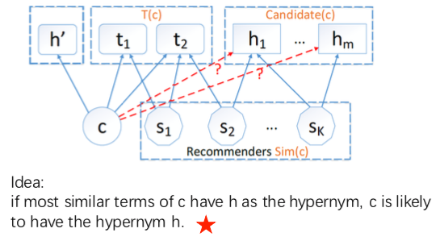

## 智慧旅游项目每周汇报（五）

### 一、ADL96讲座三：大规模知识图谱构建与应用

讲者：复旦大学教授肖仰华

笔记：

<h3 id='0.'>0. 讲义的引导部分</h3>

1. 为何自然语言理解（机器理解自然语言）如此困难？
    1. 自然语言复杂：
        + **_自然语言是Ambiguous（存在歧义，一词多义，一义多词）, contextual（理解时需要基于上下文的，不同语境存在不同意思）, implicit（隐晦的，有时表达不直接）_**；
        + 有多种方式去表达相同意思（上述已说明这点）；
    2. 自然语言理解困难：
        + 基于human cognition且需要大量的background knowledge；
            

2. 机器自然语言理解需要large-scale, semantically rich and friendly structrue 的 background knowledge bases；
    + 传统的知识表示无法满足需求：Ontology, Semantic network, texts；
    + knowledge graph与[semantic network][]之间的关系日益模糊；knowledge graph是边加上了限制规则的语义网络，以便在其上使用代数（ Knowledge Graphs, which are semantic networks but with the added constraint that edges are restricted to be from a limited set of possible relations, to facilitate algebras on the graph）； 
  
3. 知识图谱knowledge graph正在不断融合，几个重要的知识图谱knowledge graph：  
    1. [Yago][]：由德国马普研究所研制的链接数据库，主要集成了Wikipedia, WordNet, GeoNames三个来源的数据;
        + Yago wiki: <https://en.wikipedia.org/wiki/YAGO_(database)>;
        + Yago source code: <https://github.com/yago-naga/yago3>; 
    2. [WordNet][]：WordNet是由Princeton 大学的心理学家，语言学家和计算机工程师联合设计的一种基于认知语言学的英语词典。它不是光把单词以字母顺序排列，而且按照单词的意义组成一个“单词的网络”;
        + WordNet wiki: <https://en.wikipedia.org/wiki/WordNet> 
    3. [Freebase][]：Freebase是个类似wikipedia的创作共享类网站，所有内容都由用户添加，采用创意共用许可证，可以自由引用。两者之间最大的不同在于，Freebase中的条目都采用结构化数据的形式，而wikipedia不是。
        + Freebase wiki: <https://en.wikipedia.org/wiki/Freebase>;
        + Freebase github: <https://github.com/google/graphd>;
    4. [Probase][]：The goal of Probase is to make machines “aware” of the mental world of human beings, so that machines can better understand human communication. We do this by giving certain general knowledge or certain common sense to machines.
    
    5. [NELL][]：
    6. [DBpedia][]:
        + DBpedia wiki: <https://zh.wikipedia.org/wiki/DBpedia>
        
<h3 id='1.'>1. 如何使用知识图谱来使机器理解人类语言</h3>

例举两个使用知识图谱来帮助机器理解人类语言的例子：

<h4 id='1.1.'>1.1. Probase and Probase+</h4>

1. 构建知识图谱有两种方法：人工构建、数据驱动的自动构建；
2. Hearst pattern：数据驱动构建的Probase使用Hearst pattern来发现与抽取信息；
3. Probase and Probase+:
    1. Probase：基于Hearst pattern构建；
        + 由于**数据稀疏性**，许多`isA`关系很难明显地出现在Hearst pattern中-->导致大量`isA`关系丢失；
    2. Probase+：使用基于协同过滤的框架来补全Probase知识图谱；
        
        
4. 相关论文： Inferring Missing links in Conceptual Taxonomies, TKDE 2017;       
        
<h4 id='1.2.'>1.2. DBpedia and CN-DBPedia</h4>
    
1. DBpedia：基于维基百科，从维基百科抽取结构化数据来构建；
2. CN-DBpedia：中文部分的DBpedia，由复旦大学知识工厂创建；

<h3 id='2.'>2. 大规模知识图谱的数据驱动构建方法</h3>
    
<h4 id='2.1.'>2.1. 知识图谱构建的关键问题</h4>

1. 耗费Cost;
2. 质量Quality;
3. 时效性Freshness;

<h4 id='2.2.'>2.2. 基于数据驱动的知识图谱构建过程步骤一：知识抽取Extraction</h4>

1. 抽取方式：1）端到端end-to-end；2）Domain specific；
2. 知识抽取举例：Probase抽取方式--Hearst linguistic patterns；
3. Hearst patterns相关论文：
    1. Hearst Patterns Revisited: Automatic Hypernym Detection from Large Text Corpora；
    2. Automatic Acquisition of Hyponyms from Large Text Corpora；

4. 参考资料：
    + [点互信息Pointwise Mutual Information](https://blog.csdn.net/index20001/article/details/79079031)
    + [sklearn: 点互信息与互信息](https://blog.csdn.net/u013710265/article/details/72848755)
    
    
<h4 id='2.3.'>3. 基于数据驱动的知识图谱构建过程步骤二：知识补全Completion</h4>

  
    
    
    
    
    
    
    
[semantic network]: https://en.wikipedia.org/wiki/Semantic_network
[Yago]: http://www.openkg.cn/dataset/yago
[WordNet]: https://wordnet.princeton.edu/
[Freebase]: https://developers.google.com/freebase/
[Probase]: https://www.microsoft.com/en-us/research/project/probase/
[NELL]: http://rtw.ml.cmu.edu/rtw/    
[DBpedia]: https://wiki.dbpedia.org/    
    
    
    
    
    
    
    
    
    
    