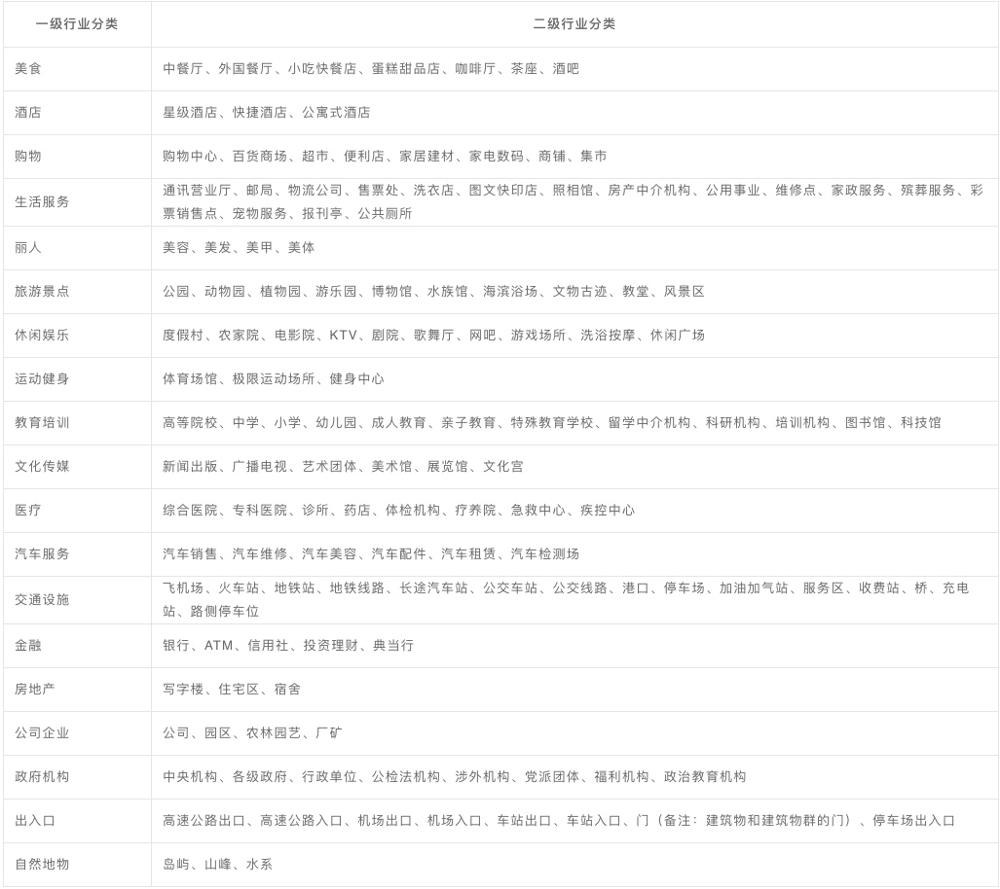
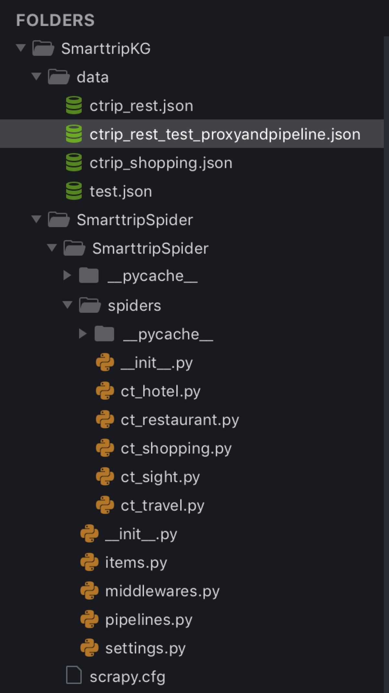

## 智慧旅游项目期末汇报（九）

由于春运回海南的航班比较贵，只有今早10点半的航班价格比较便宜，所以通过文字报告的形式汇报进展。

### 一、百度POI数据与原旅游知识图谱融合进展汇报

1. 主要是在本地的旅游知识图谱完成融合：
    1. 先是将百度**交通**poi数据融合进知识图谱，由于原数据库中只包含景点、酒店、餐厅的数据，不包含交通的数据，所以融合时未发现数据冲突的问题；
    2. 上周五组会时，受于总启发，在实际应用中，不同数据源、不同数据库上的数据可能会存在冲突。观察百度api文档中说明的poi数据类型，如下图，
         
    
        我发现百度的poi数据中也涵盖了美食、酒店、景点的poi数据，那么这些“百度知识”就会与原知识图谱的景点知识、美食知识、酒店知识发生冲突，这就导致了几种情况：
        1. 多实体指称项mention对应一个实体entity，比如“百度的龙泉鸡饭店xx路店”与“美团的龙泉鸡饭店xx路店”其实指代都是同一个实体；
        2. 同一个实体的属性不同，比如“百度的龙泉鸡饭店xx路店，经度=162.1，纬度=18.9”，而“美团的龙泉鸡饭店xx路店经度=159.2，纬度=19.3”，这种知识冲突是不同数据源使用的经纬度标准不同导致的在知识图谱领域；
    
        这就涉及**多数据源**知识图谱构建的知识融合，所以最近主要在看一些知识融合的论文；

### 二、单数据源的旅游知识图谱构建

1. 在了解知识融合的过程中，另一方面，我还主要研究通过单一数据源来构建咱们的旅游知识图谱（复旦大学CN-DBpedia知识图谱的构建思路），这样能够绕开知识融合的问题。
2. 思路：以携程作为单一数据源，从携程抽取美食、景点、购物、酒店等半结构化知识，以及游记等非结构化知识（用于实体识别、关系抽取来补充知识图谱实体和关系）；
3. 工作进展：知识抽取代码已经基本完成，主要是使用scrapy+mongodb完成美食、景点、购物点、游记、酒店的知识抽取，spider+redis完成ip代理规避网站反爬虫：
    1. 现在能抽取到餐厅数据10000+条，虽然字段不比美团多，但是数量和质量都很不错；
        1. 
    2. 购物点数据（为清洗、只爬了一半）5726条
        1. 
    3. 抽取部分代码结构：
        1. 

