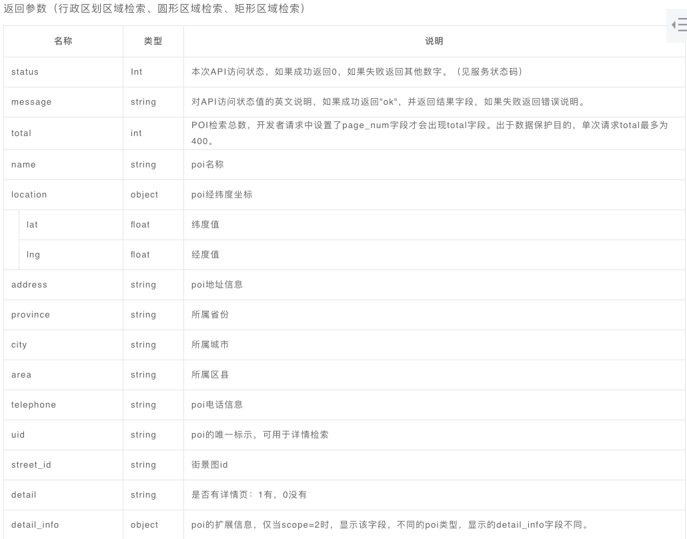
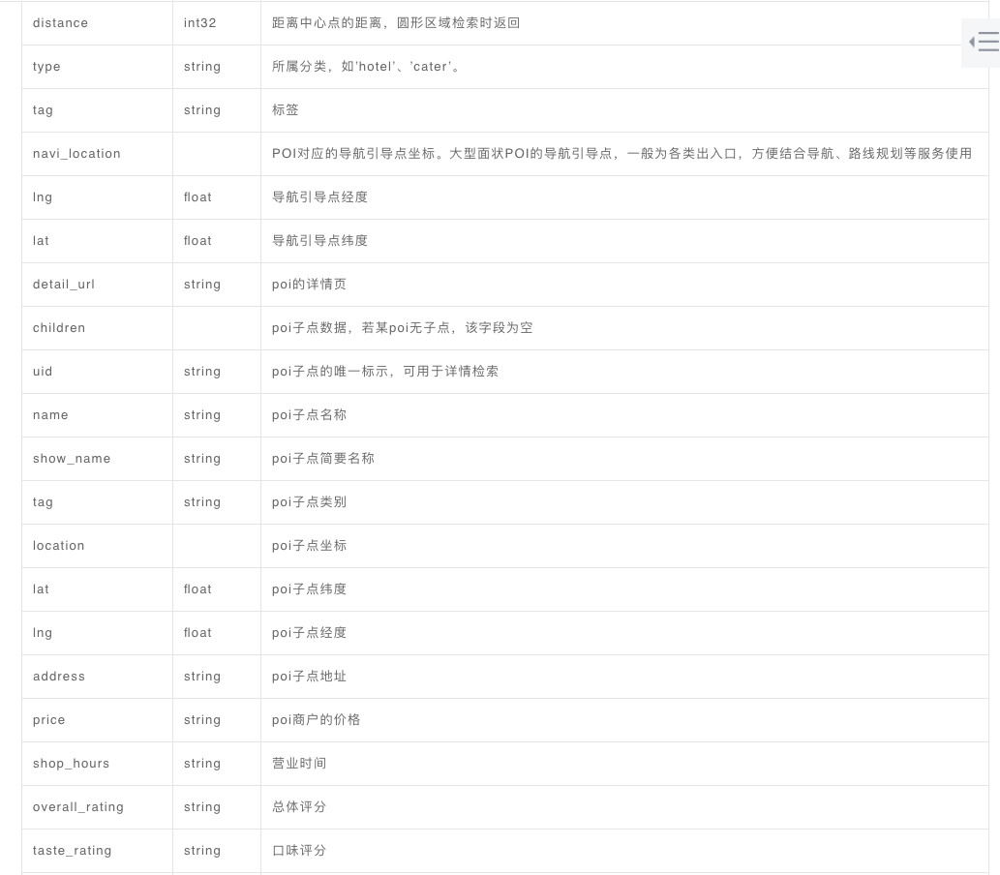
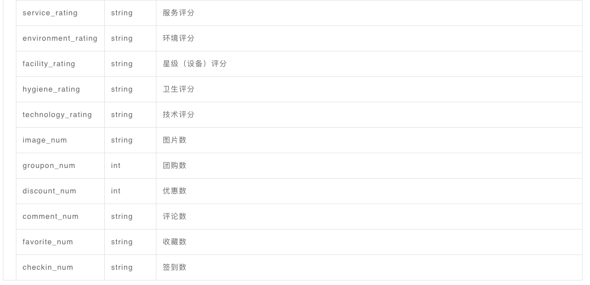
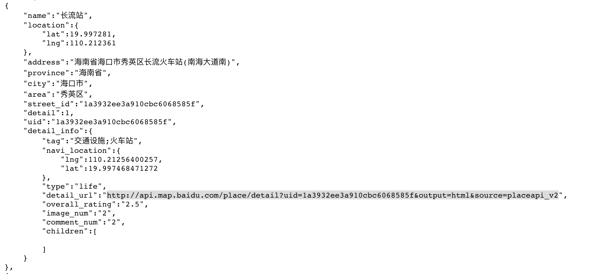

## 智慧旅游项目每周汇报（七）

### 一、进度汇报

本周进度报告主要是对这周完成的百度地图POI数据爬虫任务进行汇报

### 二、兴趣点数据介绍

POI是“Point of Interest”的缩写，中文可以翻译为“兴趣点”。在地理信息系统中，一个POI可以是一栋房子、一个商铺、一个邮筒、一个公交站等。

传统的地理信息采集方法需要地图测绘人员采用精密的测绘仪器去获取一个兴趣点的经纬度，然后再标记下来。正因为POI的采集是一个非常费时费事的工作，对一个地理信息系统来说，POI的数量在一定程度代表着整个系统的价值。

每个POI包含四方面信息，名称、类别、坐标、分类，全面的POI讯息是丰富导航地图的必备资讯，及时的POI兴趣点能提醒用户路况的分支及周边建筑的详尽信息，也能方便导航中查到你所需要的各个地方，选择最为便捷和通畅的道路来进行路径规划，因此，导航地图POI多少状况直接影响到导航的好用程度。

### 三、百度POI数据

百度地图Web服务API为开发者提供http/https接口，即开发者通过http/https形式发起检索请求，获取返回json或xml格式的检索数据。用户可以基于此开发JavaScript、C#、C++、Java等语言的地图应用。

**[地点检索服务](http://lbsyun.baidu.com/index.php?title=webapi/guide/webservice-placeapi)**

地点检索服务（又名Place API）是一类Web API接口服务；
服务提供多种场景的地点（POI）检索功能，包括**城市检索、圆形区域检索、矩形区域检索**。开发者可通过接口获取地点（POI）基础或详细地理信息。

**矩形区域检索接口**

```
http://api.map.baidu.com/place/v2/search?query=银行&bounds=39.915,116.404,39.975,116.414&output=json&ak={您的密钥} //GET请求
```
请求参数详情，请参阅<http://lbsyun.baidu.com/index.php?title=webapi/guide/webservice-placeapi>;

返回参数详情







**百度POI数据类型**


### 四、百度交通设施POI数据爬取实现

由于百度地点检索Place API对于单个URL请求最多返回400个兴趣点数据，则使用行政区域检索接口无法爬取到海口市的所有兴趣点POI数据。所以，本次爬虫使用矩形区域接口，通过将大矩形区域划分成若干小矩形区域来绕开百度API的限制。

**实现思路**

1. 获取百度API AK;
2. 使用百度地图的坐标拾取器接口来大致获取海口市行政矩形区域(左下角坐标，右上角坐标);
3. 将海口市行政矩形区域划分成若干小举行区域，尽量保证每个矩形中的兴趣点<400个;
4. 使用requests库请求百度Place API来获取海口市交通设施兴趣点数据;

**爬虫结果**

通过将小矩形宽度设置成0.03，总共爬取到海口市交通设施poi数据3769条，保存成json文件；

**结构化POI数据格式**


 
### 五、参考资料
 
1. <https://blog.csdn.net/m0_38137231/article/details/80698278>;
2. <https://blog.csdn.net/sinat_41310868/article/details/78746094>;
3. <https://blog.csdn.net/sinat_41310868/article/details/78746224>;
4. <https://blog.csdn.net/sinat_41310868/article/details/78746251>;
5. <https://blog.csdn.net/qq_34464926/article/details/79128211>;
6. [百度地图坐标拾取器](http://api.map.baidu.com/lbsapi/getpoint/index.html);
