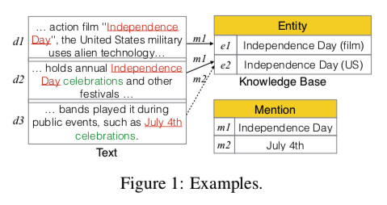
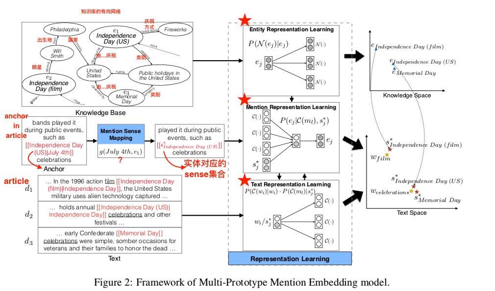
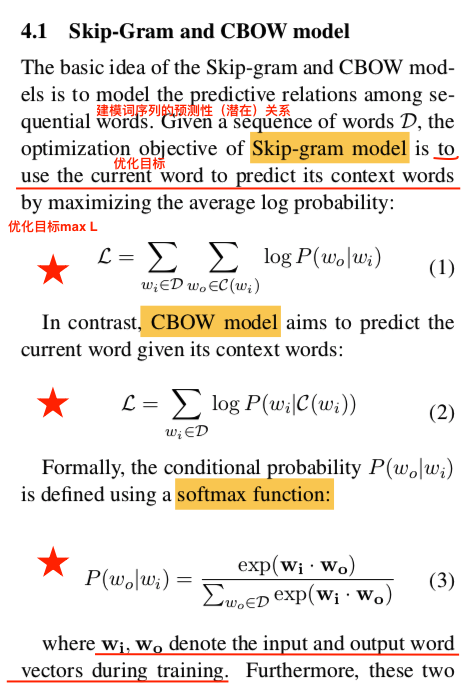
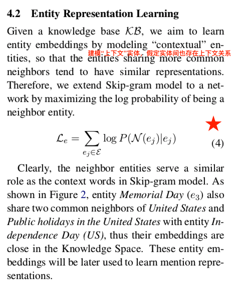
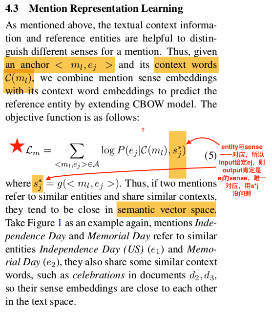
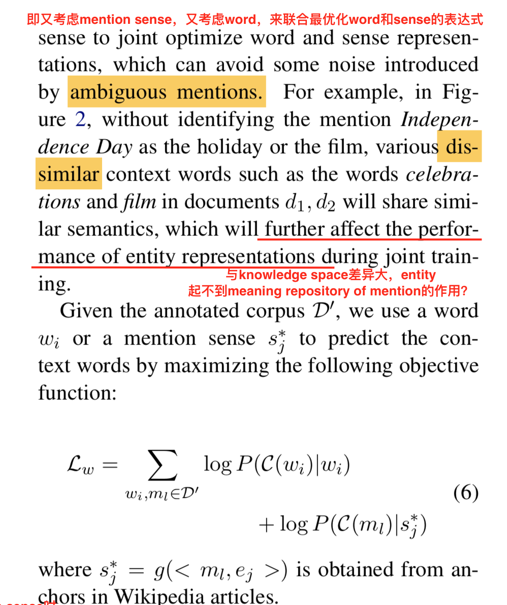
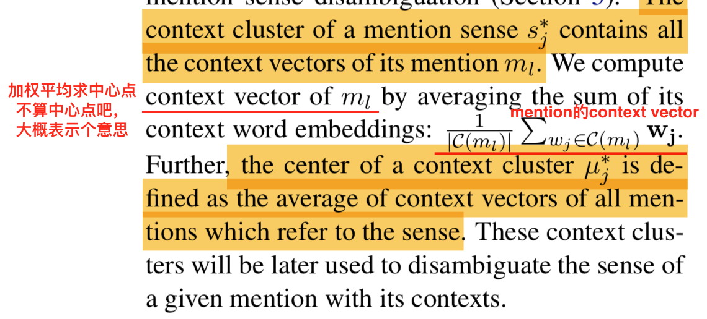
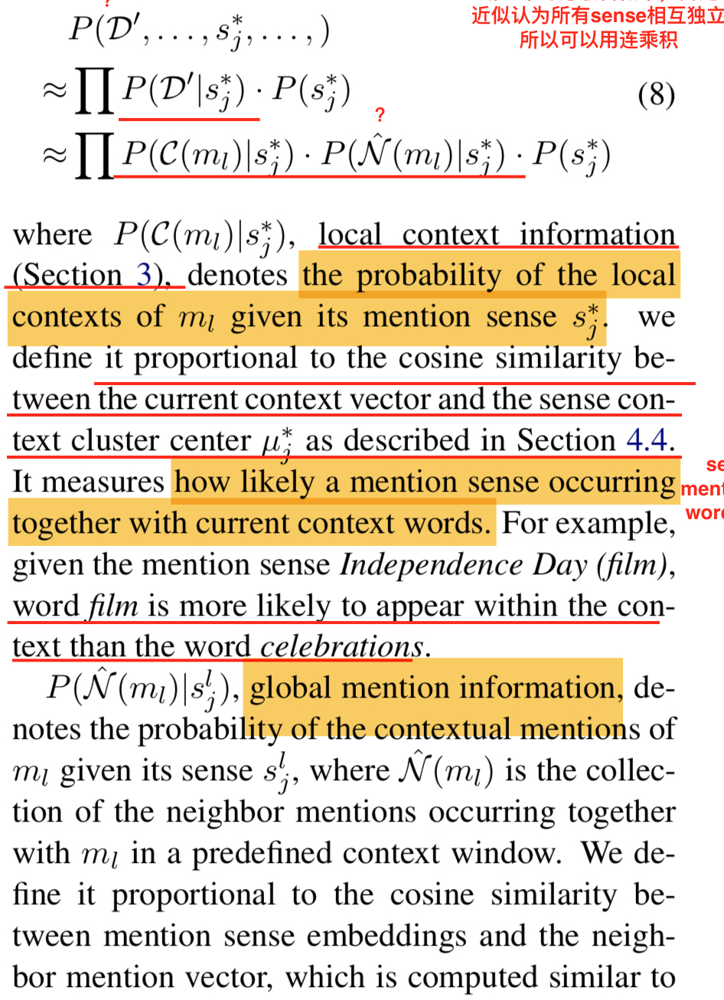
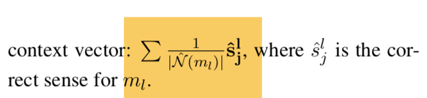
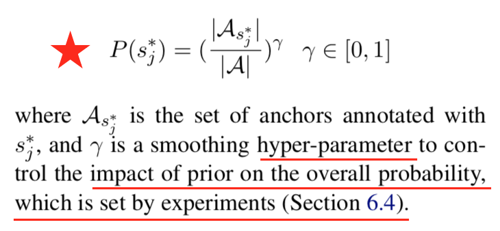

## 智慧旅游项目每周汇报（六）

<h3 id='1.'>一、前言</h3>

<h3 id='2.'>二、Bridging Text and Knowledge by learning Multi-Prototype Entity Mention Embedding论文学习</h3>

<h4 id='2.0.'>0. 摘要</h4>

1. 研究目的：将非结构化文本数据与结构化的知识库数据集成到统一的语义空间；
2. 挑战与困难：在相同的语义空间中建模存在指称歧义的挑战；
    
           

3. 论文提出：
    1. Multi-Prototype Mention Embedding --> 通过关联文本上下文与知识库实体建模words来为每一个指称项mention学习多个mention sense embeddings；
    2. 语义模型的方法 --> 消除每个mention到特定sense的歧义；

<h4 id='2.1.'>1. 介绍</h4>

1. 用处：knowledge graph completion, relation extraction, word sense disambiguation, entity classification and linking;
2. 两种实现方法：
    1. using DNN encoding word and entity;
        + 缺点：
            + 受限于文本语料与实体量的规模大小；
       
    2. learn word and entity embedding separately, and then align similar words and entities int a common space with the help of wiki hyperlink;
         + 问题/困难：
            + 在相同语义空间中，指称项具有歧义，可能指代多个实体；
            + 一个实体可能有多个指称项（别名）
3. 灵感来源：the word sense disambiguation task; 
4. 基本思路：
    1. entities in KB <--> meaning repository of mentions;
    2. mentions(words or phrases) --> one or more mention senses <--unique mapping--> one or more entities;
    3. multiple mention --> mention sense <--unique mapping-->entity;
    4. 使用mention sense 来连接text(mentions)与knowledge(entity);
    5. mention sense embedding can largely reduce the size of mention vocabulary to be learned;
5. 主要工作：
    1. jointly learns the representations of words, entities, and mentions at sense level;
    2. evaluation;

<h4 id='2.2.'>2. Preliminaries</h4>

略

<h4 id='2.3.'>3. An Overview of Our Method</h4>

1. Mention Sense Mapping：训练一个mention->sense的映射函数g();
    + 输入：指称项mention or Anchor $<m_l, e_j>$；
    + 输出：$M_l^* = \{s_j^*\}$；
    + 公式：$M_l^* = g(m_l) = \cup g(<m_l, e_j>) = \{s_j^*\} $；

2. Representation Learning:
    以知识库KB，Anchor A, 文本语料库D'为输入，学习
    1. 三种独立的模型(word, entity, mention sense representation)；
    2. 一个统一的优化目标函数；

3. Mention Sense Disambiguation:
    1. 目的：使用无监督的方式，为上下文语境中的mention选择一个正确的sense；
    2. 选择标准：
        + Sense Prior: sense的重要程度，比如那个sense使用频率更高；
        + Local context information: semantic appropriate in the context;
        + Global **mention** information: semantic consistent with the neighbor **mention**;
   
<h4 id='2.4.'>4. Representation Learning</h4>

1. Skip-Gram and CBOW model    
    1. skip-gram目标：能够从article中的所有词中预测其上下文词；
    2. cbow目标：从当前语境/词上下文猜测这是当前词
    3. 实现：
            

2. Entity Representation Learning
    1. 目标：从KB中的所有实体中预测其邻居，为后续作铺垫（通过学习，对有相同邻居的entity有相似的表达式entity embedding）；
    2. 实现：
        

3. Mention Representation Learning
    1. 目标：从给定语境/上下文与mention sense猜测mention对于的实体（通过学习，对有相同上下文和entity的mention sense有相似的表达式sense embedding）；
    2. 实现：
            

4. Text Representation Learning
    1. 目标：从给定mention与mention sense猜测对于的语境/上下文（加入了sense，避免了同一个mention的不同sense情况下的所有context混在一起，区分不同sense下的context）
    2. 实现：
        
      
      3. 对context聚类：为了用于mention sense disambiguation，论文还对context embedding进行了聚类，每一个mention sense对应一个context cluster；
            + mention sense的context cluster：即每个mention sense $s_j^l$对应的mention $m_l$的所有context vectors;
            + context vector of $m_l$: averaging the sum of its context word embeddings（公式见下图）;
            + the center of a context cluster $\mu_j^*$:如下图
             
        
5. Jointly learning(联合学习？）:
    定义了统一的优化目标函数$L = L_w + L_e + L_m$，并最大化目标函数；
 
<h4 id='2.5'>5. mention sense disambiguation</h4>

目标：对给定上下文中的mention选择正确的mention sense（消歧），从语言模型的角度来考虑，就是最大化给定文档中所有mention sense的联合概率；

近似操作：求解全局最优解的时间复杂度很高，所以论文近似认为所有mention sense相互独立，联合概率可用概率的连乘积计算；
        

        
        
 1. local context info: the probability of the local contexts of $m_l$ given its mention sense $s_j^*$, that is $P(C(m_l)|s_j^*)$; 
    + proportional to the cosine similarity be- tween the current context vector and the sense con- text cluster center μ∗j .
 2. global mention info: the probability of the contextual mentions of $m_l$ given its sense $s_j^l$;
    + Nˆ ($m_l$) is the collection of the neighbor mentions occurring together with ml in a predefined context window;
    + proportional to the cosine similarity between mention sense embeddings and the neighbor mention vector, which is computed with below formular;
        
    + mention disambiguation order: 1)L2R; 2)S2C;

 3. sense prior:a prior probability of sense s∗j indicating how possible it occurs with- out considering any additional information.
    + it proportional to the frequency of sense s∗j in Wikipedia anchors;
        
        
        

<h4 id='2.6'>6. Experiment</h4>

<h3 id='3.'>三、Bridging Text and Knowledge by learning Multi-Prototype Entity Mention Embedding论文学习</h3>

<h4 id='3.1.'>1. 摘要相关概念</h4>

+ [语义空间semantic space][1]:
    1. 概念：自然语言领域中的语义空间旨在创建能够正确捕获含义的自然语言的表达方式；Semantic spaces[note 1][1] in the natural language domain aim to create representations of natural language that are capable of capturing meaning.
    2. 动机：语义空间的最初动机源于自然语言的两大挑战：**Vocabulary mismatch**(一义多词)以及自然语言的**歧义**（一词多义）；
    3. 与基于规则或基于模型的、在关键字层面进行操作的方法的对比：
        + 自然语言领域中语义空间的应用旨在克服基于规则或基于模型的、在关键字层面进行操作的方法的局限性。
        + 基于规则或基于模型方法的缺点在于其脆弱性，以及创建基于规则NLP系统和创建模型学习的训练全集需要大量的人力；
        + 基于规则或基于模型的方法在关键字层面上是稳定的，但如果词汇与规则中定义的词汇存在偏差或词汇与统计模型使用的训练数据存在偏差，则这些方法就会崩溃；
    4. 研究历史：
        + In 1996, two papers were published that raised a lot of attention around the general idea of creating semantic spaces: [latent semantic analysis][2] and [Hyperspace Analogue to Language][3]
        + A breakthrough with regard to the accuracy of modelling associative relations between words (e.g. "spider-web", "lighter-cigarette", as opposed to synonymous relations such as "whale-dolphin", "astronaut-driver") was achieved by [explicit semantic analysis][4] (ESA) in 2007.
        + ESA: ESA was a novel (non-machine learning) based approach that represented words in the form of vectors with 100,000 dimensions (where each dimension represents an Article in Wikipedia). However practical applications of the approach are limited due to the large number of required dimensions in the vectors.
        + More recently, advances in neural networking techniques in combination with other new approaches (tensors) led to a host of new recent developments: [Word2vec][5] from Google, [GloVe][6] from Stanford University, and [fastText][7]from Facebook AI Research (FAIR) labs.
+ 文本text：文本是一种非结构化数据，与word对应；
+ 知识库knowledge：知识库是一种结构化数据，与entity对应；
+ 实体指称entity mention：a bunch of words that means one or more concept；
+ word embedding, entity embedding, sense embedding?

[1]: https://en.wikipedia.org/wiki/Semantic_space
[2]: https://en.wikipedia.org/wiki/Latent_semantic_analysis
[3]: https://en.wikipedia.org/wiki/Hyperspace_Analogue_to_Language
[4]: https://en.wikipedia.org/wiki/Explicit_semantic_analysis
[5]: https://en.wikipedia.org/wiki/Word2vec
[6]: https://en.wikipedia.org/wiki/GloVe_(machine_learning)
[7]: https://en.wikipedia.org/wiki/FastText

<h4 id='3.2'>2. Introduction相关概念</h4>

1. 知识图谱补充knowledge graph completion：
2. 关系抽取relation extraction:
3. 实体分类entity classification:
4. 实体链接entity linking:
5. 词义消歧word sense disambiguation：
6. 指称含义mention sense：一个指称项所指代的一个或多个意义；
7. skip-gram model and CBOW model

<h4 id='3.3'>3. Preliminaries相关概念</h4>

1. 文本语料库text corpus：
2. annotated文本语料库annotated text corpus：
3. mention boundary：

<h4 id='3.4'>4. An overview of Our Method的相关概念</h4>

1. 统一的优化目标函数unified optimization objective:
2. 实体链接entity linking: 为文本中的指称项mentions识别出其对应的reference entity；

<h4 id='3.5'>5. Representation Learning的相关概念</h4>

1. 分布表示Distributional representation:
2. semantic compositionality
3. Skip-Gram and CBOW model
4. softmax function
5. hierarchical softmax
6. negative sampling
7. 案例分析case study

<h3 id='4.'>四、疑点难点</h3>

1. word, entity, mention?
2. sense embedding, word embedding, entity embedding?
3. at sense level? at keyword level?
4. mention boundary?
5. language model?
6. entity linking?
7. 4.4 WSD? WDS?
8. 4.5 the distribution of entities will help improve word embeddings?
9. semantic questions? syntactic question?
10. 6.3 $W_{France} - W_{Paris} + W_{Rome}$?
