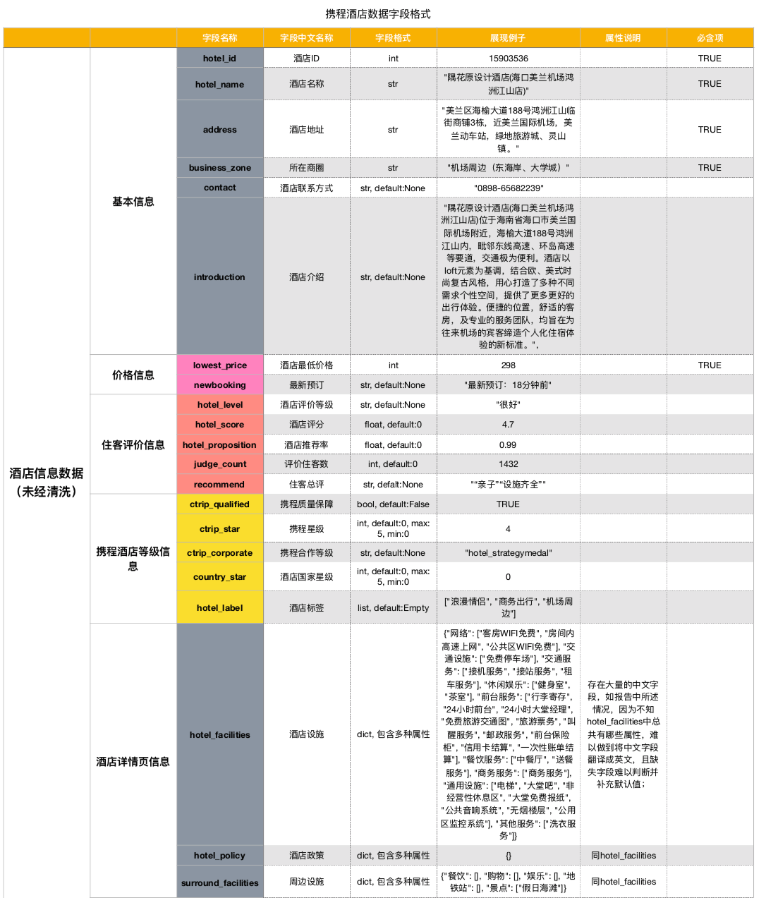

## 智慧旅游项目每周汇报（三）

### 一、前言

本周进度报告主要是对这周完成的酒店数据爬虫任务进行汇报，以及对智慧旅行项目的爬虫代码重构进行介绍。

### 二、酒店数据爬取实现

1. 本周完成了智慧旅行项目爬虫代码的重构，主要完成了对`database.py`,`spider.py`,`proxy.py`文件的修改；
2. 酒店数据爬取进展：主要爬取了三亚地区酒店数据3220条以及海口地区酒店数据1492条，总共耗时约39分钟，现已json格式存储起来，马上进行入库操作；
3. 爬取到的酒店数据字段如下：
    经过上次组会，从陈老师的报告中，我发现了交付数据格式的重要性，故作携程酒店数据字段图如下，清晰交代了数据格式：
    

### 三、本周疑难

1. 由于携程提供的酒店数据字段极多，在爬虫过程中无法确定酒店数据拥有的所有字段，导致难以判断酒店缺失哪些字段，从而难以为缺失字段补充默认值。
2. 此次酒店爬虫，酒店数据有的字段直接使用了网页中爬取到的中文作为字段名（因为无法确定酒店的所有字段，就无法事先为酒店设置英文字段名）--原先尝试使用python的一些第三方中英文翻译包，如[translate][]、[pytranslator][]，来实现携程上爬取到的中文字段名直接翻译成英文，但是翻译效果不好且速度较慢，影响爬虫效率，所以尝试不成功。
3. 尽管重构了爬虫代码，但是爬虫编写效率仍然不高，接下来会尝试一些爬虫框架，如[scrapy][]

[translate]: https://pypi.org/project/translate/

[pytranslator]: https://pypi.org/project/pytranslator/

[scrapy]: https://scrapy.org/

### 四、参考资料

1. [Python获取昨天、今天、明天开始、结束时间戳](https://blog.csdn.net/qq_26656329/article/details/73658250)；
2. [用Python计算昨天、今天和明天的日期时间](http://www.iplaypy.com/sys/s100.html)；
3. [Python 获取昨天日期](http://www.runoob.com/python3/python3-get-yesterday.html)