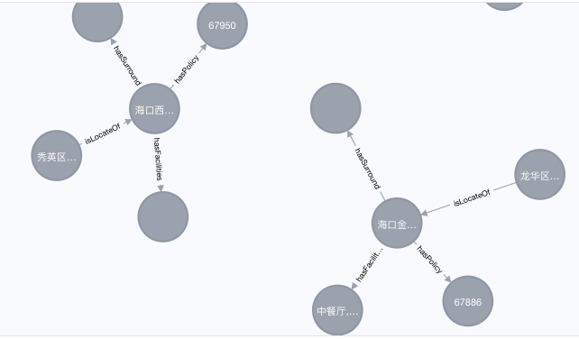
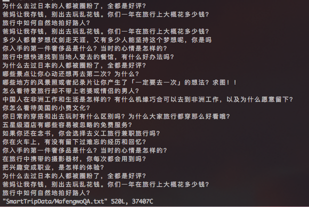

## 腾讯项目组汇报（一）--2018/09/24

### 一、前言

本次汇报主要对这两天酒店数据、问答数据爬取进展进行报告。

### 二、酒店数据爬取

本周从携程爬取到三亚酒店数据3220条和海口酒店数据1492条，并以json格式存储到`HaikouHotels.json`和`SanyaHotels.json`文件中，并完成了入图数据库neo4j操作。

酒店数据字段如下：

酒店数据在neo4j数据库中知识图谱结构如下：

### 三、马蜂窝旅游问答爬取

马蜂窝旅游问答网页使用了异步加载技术，每点击一次加载更多，在网页url不变的情况下，网页新增20个用户提问的旅游问题。针对异步加载，爬虫找到并请求对应的url：<http://www.mafengwo.cn/qa/ajax_qa/more>，同时传入相应参数来实现问题的爬取，没有遇到马蜂窝网站的反爬虫，总体来说，爬虫实现比较简单。

爬取到的问题存储到文本文件中，部分问题如下：

