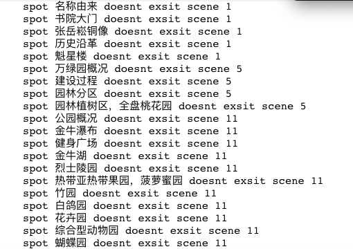
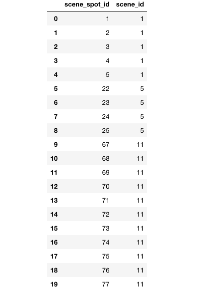

## 腾讯项目组汇报（二十五）--2018/12/21

### 一、进展汇报

<h3>1. 根据公司数据构建图谱</h3>

数据问题：

1. 景区数据缺失。许多景点数据通过idscene字段指定的景区数据无法找到，所以知识图谱的景区-景点关系无法建立。总共缺失58个景区数据，已写入到missing_data_file.csv文件中。

58个缺失的景区id概览（只罗列了前20个）

2. 景点数据中存在错误数据，比如万绿园景区中存在名为“建设过程”的景点，还有两条重复数据，分别指向万绿园景区(idscene=4)和idscene=5的景区（景区文件中不存在）；景区中存在名为“景区简介”的景点，不符合常识。 
3. 数据应该还是存在许多潜在问题的，如果依照当前数据构建知识图谱会引入许多“错误知识”。

临时解决：

由于是构建测试版的知识图谱，所以根据嘉琪姐的意思，先通过随机生成字符串来补全景区名称，再配合景区idscene来补全了58个景区节点，构建了测试的知识图谱

<h3>2. 开题报告简记</h3>

**曹明辉师兄**

主题：命名实体识别与关系抽取

命名实体识别：Lattice-LSTM

关系抽取： 

联合学习方法：

**张婉笛师姐**

主题：任务型对话系统

主要问题：依赖人工规则或模版，在引入领域数据库、上下文对话建模、跨领域对话系统

Rasa管道模型

基于海南旅游真实场景，构建与CamRest

**周成瑜师兄**

主题：开放域文档系统

速度瓶颈：信息检索模块
准确率瓶颈：答案抽取/生成模块

单文档观点类阅读理解研究

多文档描述类阅读理解研究

**张轩师兄**

HowNet义原知识图谱

**郭宸晨师姐**

主题：知识图谱零样本学习算法

