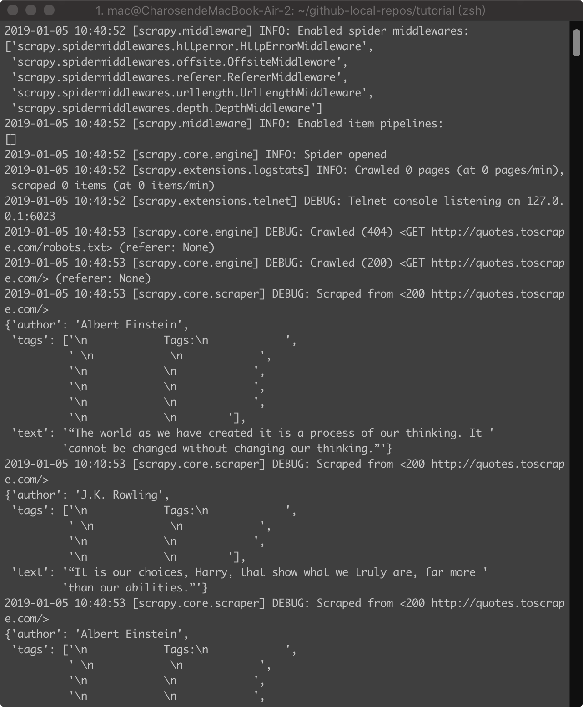

## 腾讯项目组汇报（三十）--2018/01/06

### 一、进展汇报

1. 根据之前看的论文CN-DBpedia: A Never-Ending Chinese Knowledge Extraction System，准备使用论文构建复旦知识图谱的架构重构旅游知识图谱。
    1. 最近学了下scrapy爬虫框架，准备使用scrapy完成知识抽取；
    2. 知识抽取代码完成后准备使用数据挖掘学习的数据预处理方法完成归一化，
    3. 试一试论文所涉及的cross-lingual entity-linking&typing模型
    4. 不知道能不能问作者要到源码；
    

2. 看了张老师发的中科院刘大佬的github；
3. 跑了scrapy demo
    
