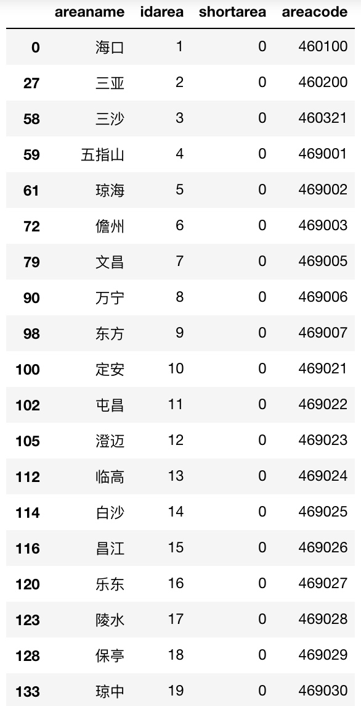

## 腾讯项目组汇报（四十四）--2019/05/27

### 一、海南旅游景区景点数据分析

针对公司提供的海南旅游景区景点数据进行分析，公司提供数据主要分为4个文件：

1. 游玩路线文件pathlist.json：包含公司自编的游玩路线的名称和简介，**共计22条**
    1. 
2. 景区文件newsceniclist.json：包含公司的景区数据，**共计242条**，每个景区有32个字段，景区地址address、城市编号areacode、 城市名areaname、音频编号audiocode、bd纬度bd_lat、bd经度bd_lon、大图标biglogo、景区介绍content、景区号id、城市号idarea、ishide、纬度lat、link360、经度lon、maplv、中图标middlelogo、游玩时间minutes、景区名称name、开放时间opentime、orderlink、半径radius、recommend、shanzhai、shortarea、景区别名shortname、小图标smalllogo、星级star、景区类别标签tag、电话tel、门票ticket、videolink、view；
3. 景点文件scenicspotlist.json：包含公司的景点数据，**共计761条**，每个景点有10个字段，bd纬度bd_lat、bd经度bd_lon、文件路径filepath、景点号id、**景点所在景区ididscene**、纬度lat、经度lon、景点mp3编号mp3code、景点名称name、半径radius

分析如下：

1. 由于是人工编写，pathlist.json路线文件无缺失，且无冗余数据；
2. newsceniclist.json文件问题：
    1. 存在诸多无意义键/列：所有数据的‘shortarea’、‘maplv’、‘ishide’、‘view’的取值全为0或者全为1，‘orderlink’的取值全为空字符串""，不知道这些键/列存在的意义是什么；
    2. 诸多键存在缺失值，包括地址address、城市编号areacode、音频编号audiocode、经度lat、纬度lon、标志middlelogo、建议游玩时间minutes、开放时间opentime、半径radius、景区简称shortname、景区标签tag、电话tel、门票ticket、视频链接videolink、link360共15个键存在缺失值，且缺失严重；
        1. 总共242条数据，存在许多字段缺失程度超50%
    3. 缺失值不统一，有的使用空字符串""表示缺失，有的使用“暂缺”表示缺失，有的使用“暂无”表示缺失，等等，缺乏基本的数据预处理
    4. 景区数据中，19个城市的areacode均存在，且所有景区数据都存在城市areaname，但是大量景区缺失areacode
        1. 从景区数据中汇总发现，19个城市的areacode均存在，
        2. 但是大量景区没有areacode，数据不一致
3. scenicspotlist.json文件问题：
    1. 少数键/列存在缺失值
        1. 

    2. **诸多景点数据的景区号idscene对应的景区在newsceniclist.json景区文件中根本就不存在，共计58个景区，这个数据冲突比较致命**；
    3. 由于第二点的景区缺失，导致景点数据冗余严重，共计465条（景点数据总共只有761条）：
        1. 根据、lat、lon、filepath、radius完全相同，可知下述同名景点应该指代同一个景点，肯定数据冗余：

4. 所有数据字段都没有对应的url，想走本体这条路有点困难；
5. 数据之间的关系缺乏，没有附近的一些关系，基本上都是在描述数据自身的属性，只存在“景区--景点”等少数关系；

        

