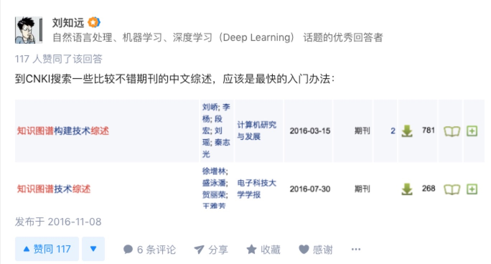

## 腾讯项目组汇报（三十一）--2018/01/07

### 一、进展汇报

1. 准备跨文化交流英语考试；
2. 阅读知识图谱综述性论文--知识图谱构建技术综述；
    1. 笔记：[知识图谱学习(一)--知识图谱构建技术综述](https://github.com/charosen/ClassNotes/blob/master/knowledge_graph/Knowledge_Graph_Construction_Techniques.md)；
    2. 看综述的缘由是看了刘知远老师在知乎上的回答；
        1. 
        
3. 看代理ip池程序；

