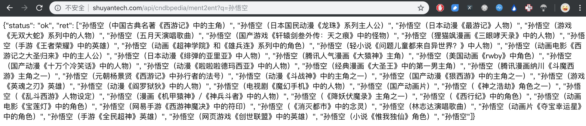
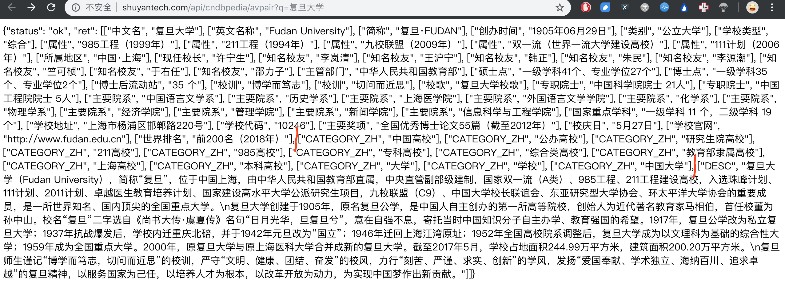
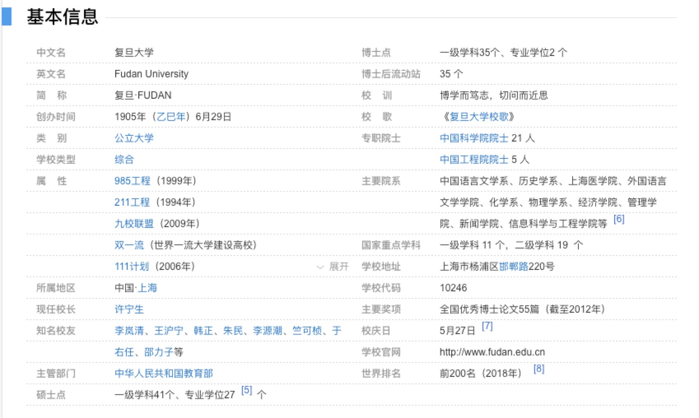
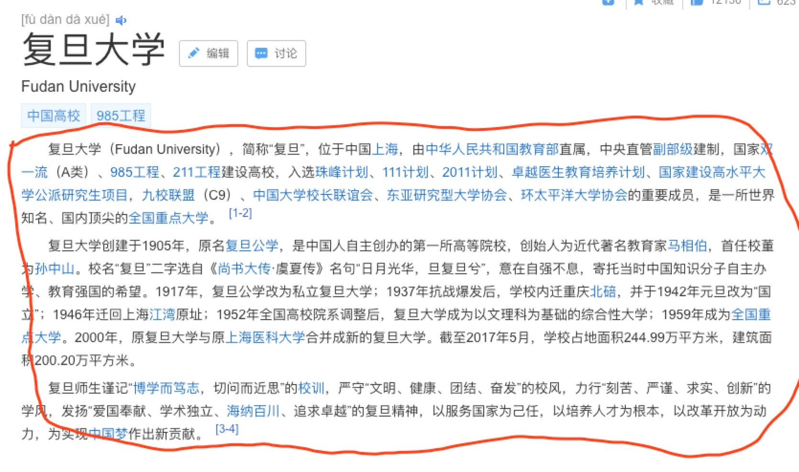
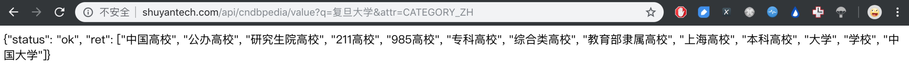

## 腾讯项目组汇报（三十二）--2018/01/09

### 一、进展汇报

1. 调研复旦大学知识图谱CN-DBpedia的接口，寻求其实现思路，CN-DBpedia包含3种API接口
    1. 实体指称项to实体接口**api/cndbpedia/ment2ent**：
        1. 输入实体指称项名称(mention name)，返回对应实体(entity)的列表，json格式；
        2. 
    2. 实体to实体接口**api/cndbpedia/avpair**：
        1. 输入实体名（必须为知识图谱中切实存在的实体），返回实体全部的三元组知识；
        2. 
        3. 从返回结果中，对照复旦大学百度百科页面可以发现，知识图谱中的实体-关系-实体三元组主要可以分为三部分（图中红线区分），分别来自百科页面，并认为百科数据完全可靠，未加修改：
            + 百科infobox（对应第一部分）
            + 百科词条标签（对应CATEGORY_ZH部分）
            + 百科简介（对应DESC部分）
    1. 实体to属性值接口**api/cndbpedia/value**：
        1. 给定实体名和属性名，返回属性值，不管是属性还是关系都能查到，所以不清楚CN-DBpedia是否区分属性、关系；
        2. 
1. 总结刘峤的知识图谱构建技术综述的[学习笔记](https://github.com/charosen/ClassNotes/blob/master/knowledge_graph/Knowledge_Graph_Construction_Techniques.md)；
2. 学习复旦大学通用百科知识图谱CN-DBpedia构建的讲义，确定旅游知识图谱的构建框架，笔记总结ing；

