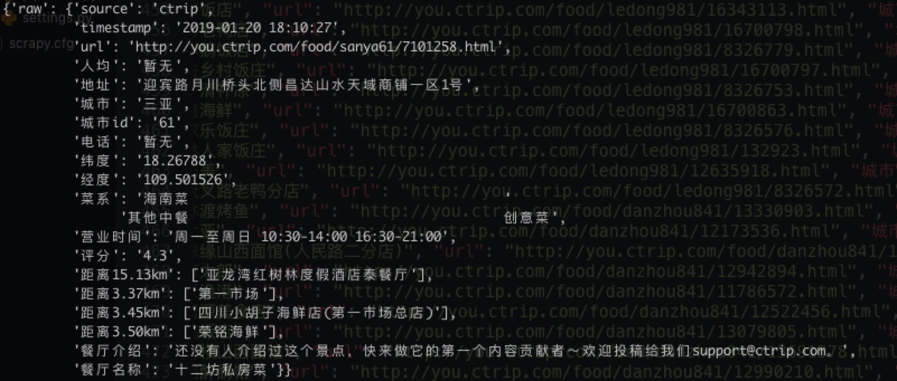

## 腾讯项目组汇报（三十二）--2019/01/20

### 一、进展汇报
1. python的包内导入：[相对导入与绝对导入](https://www.jianshu.com/p/5cc20b88bcf4)
2. 编写通信知识图谱中期答辩ppt
3. 智慧旅游知识图谱--携程美食半结构化知识抽取：
    1. scrapy实现美食爬取
    2. redis+flask+爬虫实现代理ip池
    3. fake-useragent实现随机请求头
    4. 数据爬取情况：
        1. 共爬取携程餐厅6958条（海口：1047/18764；三亚：1414/10389；三沙：3/3；琼海：216/1341；万宁：795/820；陵水：105/703；文昌：844/886；保亭：173/177；东方：741/754；五指山：116/118；儋州：265:1314；乐东：199/201；昌江：0/277；临高：290/298；澄迈：178/512；定安：178/217；白沙：30/90；屯昌：179/182；琼中：113/122）
        2. 数据格式：
    5. 存在问题：因为免费代理无稳定，导致爬虫提前停止，大量数据丢失，待改进
    
