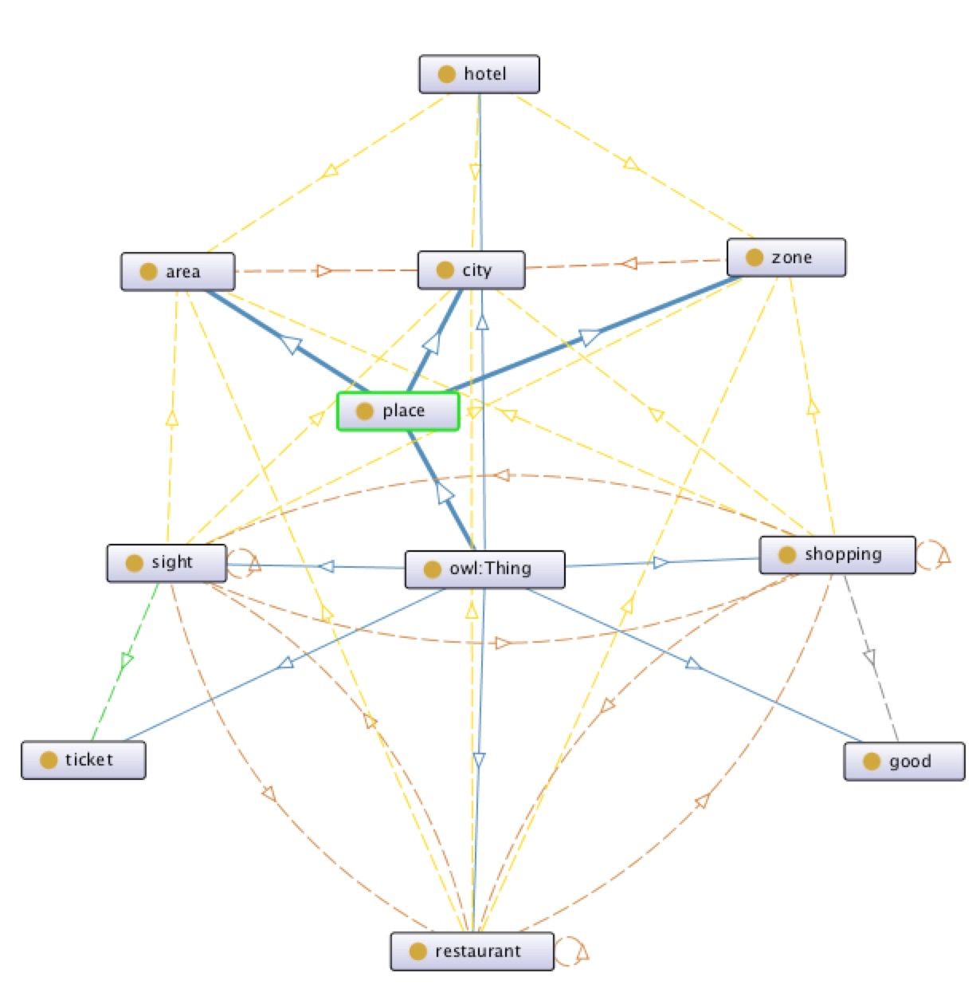
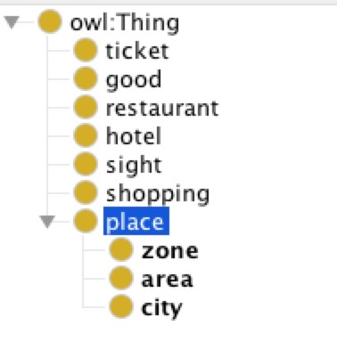
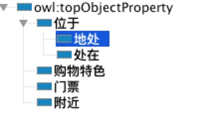
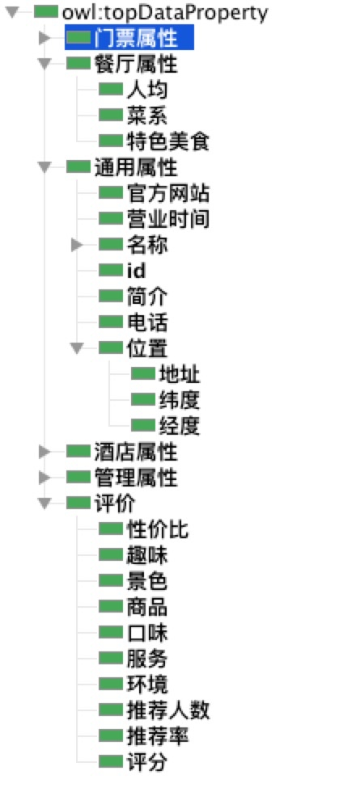

## 腾讯项目组汇报（三十四）--2019/02/25

### 一、工作进展

1. 阅读RDFS 1.1与OWL 2文档，并总结至[笔记](https://github.com/charosen/ClassNotes/blob/master/knowledge_graph/semantic_web_stack.md);
2. 定义海南智慧旅游知识图谱本体：
    1. class relationship：
    2. class hierarchy：
    3. 对象属性：
    4. 数据属性：

