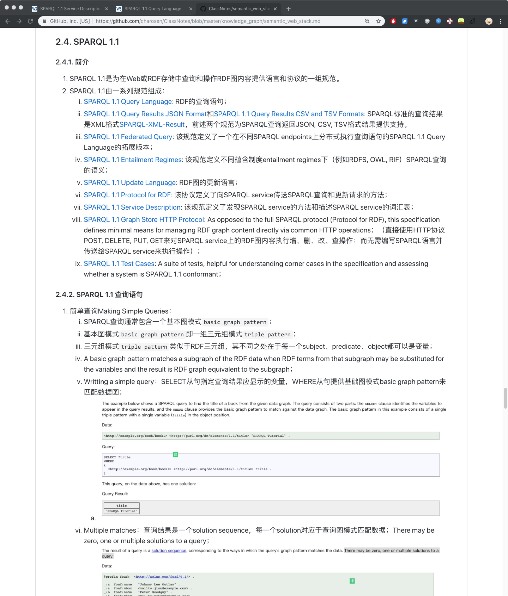
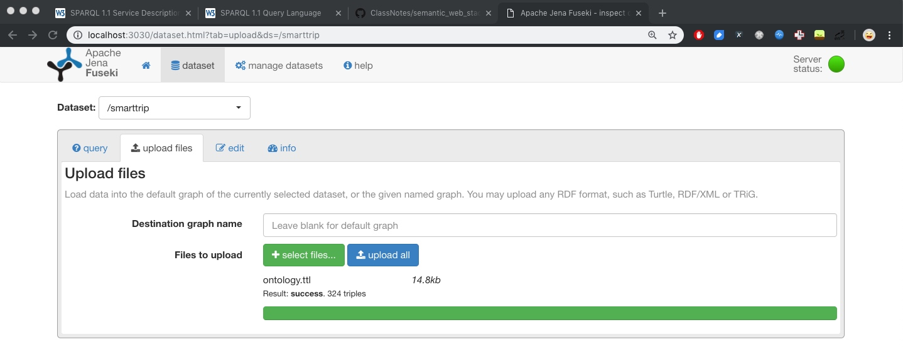
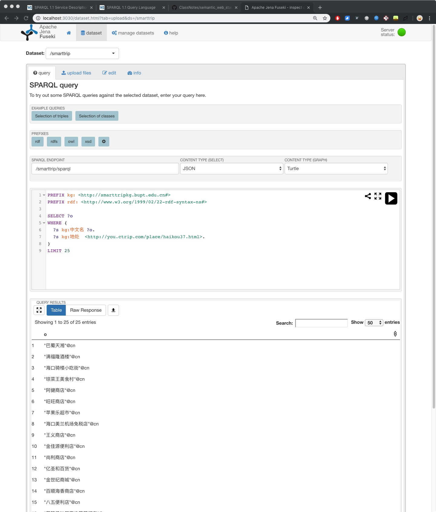
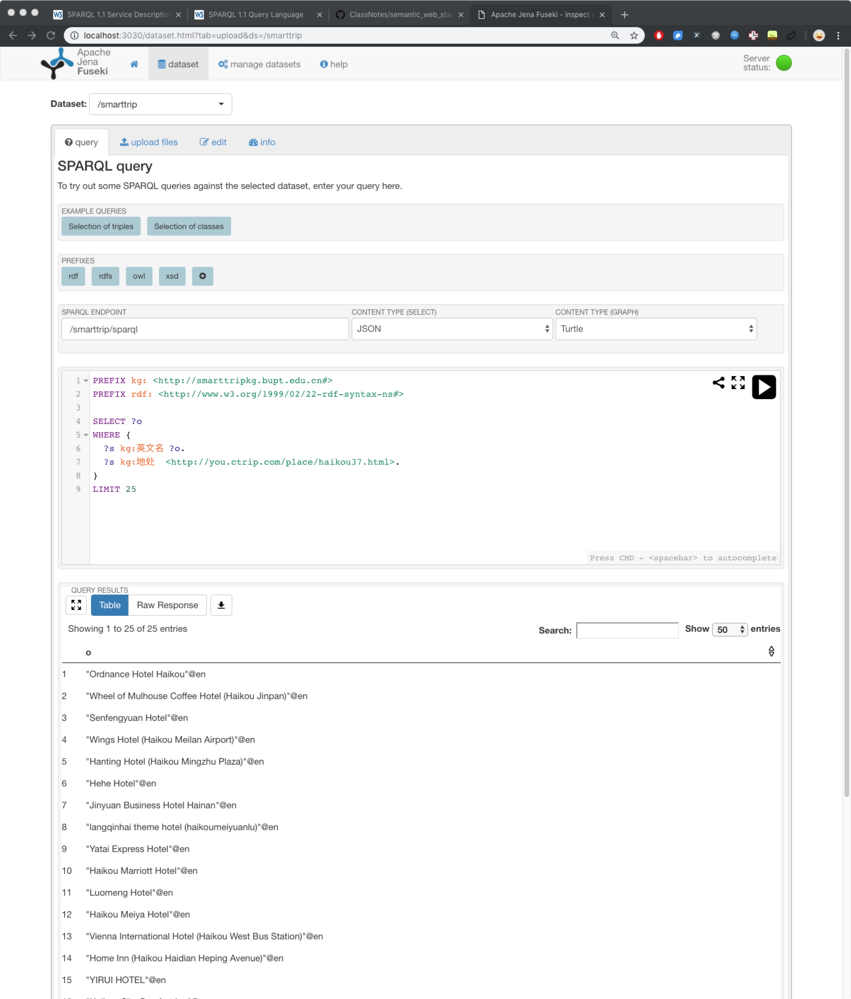
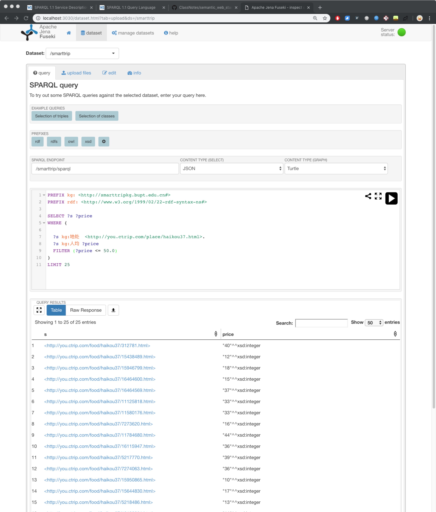

## 腾讯项目组汇报（三十四）--2019/02/28

### 一、工作进展

1. 阅读SPARQL文档，并总结至[笔记](https://github.com/charosen/ClassNotes/blob/master/knowledge_graph/semantic_web_stack.md);
    1. 
2. 使用jena--一个构建语义网与linked data的开源java框架，来搭建旅游知识图谱的SPARQL endpoint，支持使用SPARQL查询旅游知识图谱；
    1. 支持上传自定义旅游本体
    2. 使用SPARQL查询位于海口市的所有中文实体名
    3. 使用SPARQL查询位于海口市的所有酒店英文实体名
    4. 使用SPARQL查询位于海口市的所有人均消费低于50元的餐厅

