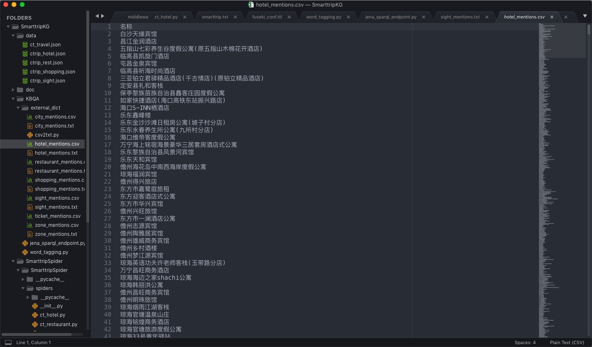
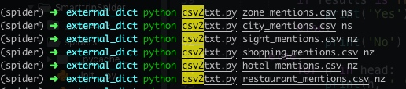
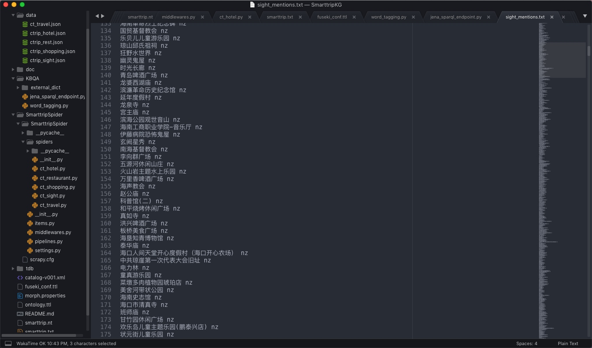
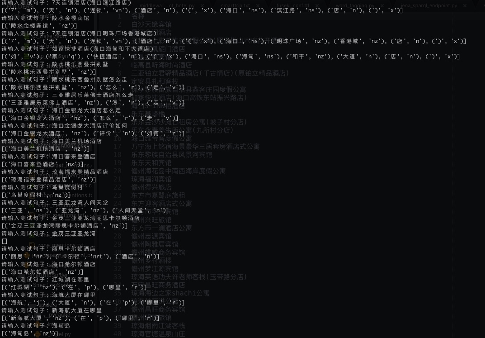

## 腾讯项目组汇报（三十五）--2019/03/03

### 一、工作进展

1. 学习openKG上的KBQA demo[基于 REfO 的 KBQA 实现及示例](http://openkg.cn/tool/eb483ee4-3be1-4d4b-974d-970d35307e8d)；
2. mongo导出景点、酒店、购物、餐厅、行政区、城市的名称，得到海南旅游的专业名词csv文件：
    1. 导出方法1：`mongoexport`命令；
    2. 导出方法2：使用NoSQLBooster软件中的导出功能；
    3. 
3. 改写demo的`csv2txt.py`模块：
    1. 支持命令行输入`csv文件路径`参数和`词性`参数，调用方式如下：
        1. 
    2. 使用`csv2txt.py`模块将之前导出的专有名词csv转换成jieba格式的外部自定义词典，供后续导入jieba：
        1. 
    3. 改写demo的分词模块：
        1. 导入旅游专有名词词典，否则jieba无法识别海南特有的景点、酒店等名词；
        2. 使用jieba.posseg对问句进行分词、词性标注；
        3. 分词效果：
            1. 
        4. 存在问题：只有当jieba精确匹配外部词典的专业名词时，才能够正确分词，比如`新海航大厦`(外部词典中存在)改成`海航大厦`(外部词典不存在)时，jieba分词错误；

