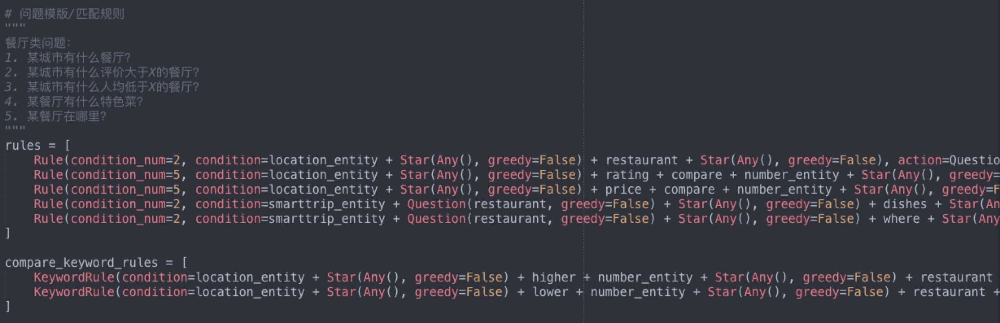
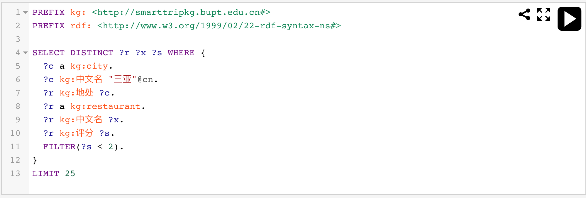
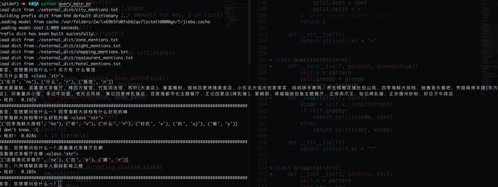
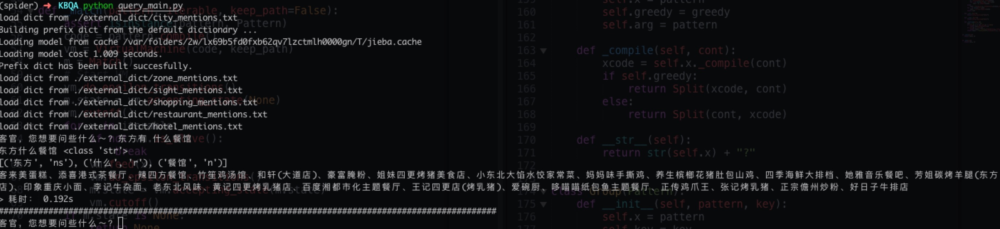

## 腾讯项目组汇报（三十六）--2019/03/06

### 一、工作进展

1. 改写openKG上的KBQA demo[基于 REfO 的 KBQA 实现及示例](http://openkg.cn/tool/eb483ee4-3be1-4d4b-974d-970d35307e8d)代码，应用到海南旅游知识图谱；
2. 改写`query_temp.py`模块，定义属于海南的问题模版：
    1. 现能回答3类餐厅类问题：
    2. 
    3. REfo不同于python re库，re库只能对字符串进行正则匹配，而REfo是对象级别的正则匹配库，所以可以用于正则匹配我们自定义的Word类的任意实例；
3. 改写`jena_sparql_endpoint.py`模块：
    1. 该模块主要用于与知识库进行查询、更新交互，查询语句与协议使用的是SPARQL 1.1；
    2. SPARQL查询语句是基于triple pattern的方式查询的，相较于SQL、Cypher等数据库查询，这种三元组的查询形式比贴合知识图谱的形式化表示；
    3. 查询语句例子：查询三亚市评分低于2分的所有餐厅的中文名；
    4. 上述查询语句中每一行都是一个triple pattern；
4. 最终问答效果：
    1. 
    2. 
    3. 优缺点分析：
        1. 缺点：基于规则的qa的回答都比较生硬，更倾向于直接返回知识图谱中的知识；而且，只能完成单论问答；
        2. 优点：虽然需要定义规则才能回答问题，但是REfo使得拓展规则十分方便，面向海南旅游领域的问题规则的数量也不算太大，使用规则回答一些简单问题可以辅助其他qa模型；

参考资料：
 1. [Regular Expressions for Objects](https://rolisz.ro/2018/06/08/regular-expressions-for-objects/);
 2. [refo github库](https://github.com/machinalis/refo);
 3. [jieba分词](https://github.com/fxsjy/jieba);

