## 腾讯项目组汇报（三十七）--2019/03/07

### 一、工作进展--论文阅读“Multi-Task Learning with Multi-View Attention for Answer Selection and Knowledge Base Question Answering”
1. abstract:
    1. qa存在多个子任务，主要有question answering, open-domain question answering, answer selection, community question answering, knowledge base question answering....
    2. AS和KBQA是QA重要的两个子任务；但现有方法分开处理两个任务；
    3. 动机：
        1. KBQA和AS任务都可以看作是一个排序问题，一个在text-level，一个在knowledge-level；
        2. 先前的工作证明，使用KB的外部知识可以辅助完成AS，AS中学习到的上下文信息可以改善KBQA；
        3. 为了实现联合学习这两项任务，本文考虑用多任务学习。
    4. 贡献：
        1. 提出了多任务学习方案，利用从不同角度学习的多视图注意力multi-view attention，使AS和KBQA任务相互交互，并学习更全面的句子表示sentence representations;
        2. 如何使任务相互交互的呢，具体而言，就是从多个task-specific layers学习multi-view attention，从而将来自特定任务层的注意信息汇总到共享层中学习更全面的句子表示；
        3. 另外，multi-view attention机制通过结合word-level和knowledge-level信息增强句子表示学习。即：通过multi-view attention方案，word-level和konwledge-level的attentive信息在不同任务中共享和迁移;
    5. 效果：
        1. 最后在每个单任务上，这篇论文都实现了非常不错的效果。而且证明了多视角的注意力机制可以有效地从不同的表示视角上组合注意力信息;(the multi-view attention scheme is proved to be effective in assembling attentive information from different representational perspectives.)
2. intro:
    1. Answer Selection: 给定一个问题，旨在从候选答案集中选取正确答案；
        1. 当前研究：深度学习模型Deep learning model, 注意力机制Attention model, 外部知识External Knowledge;
    2. KBQA: 给定一个问题，旨在从知识库中选取一个事实来回答问题；
        1. 当前研究：语义解析Semantic Parsing, 深度学习模型Deep learning model, 上下文信息Contextual information;
    3. machine reading comprehension: 给定一个问题与一篇文章，从文章中选取内容回答问题；
    4. 现状：
        1. 多任务学习广泛应用于nlp的许多任务，比如文本分类、序列标注、text summarization；
        2. 现有的多任务学习框架一般把模型分为task-specific layers和shared layers。所有任务共享shared layers，对于每个任务，task-specific layers是独立的。这会忽略task-specific layers和shared layers的相互联系，以及不同任务之间的相互作用；
    5. 贡献again
3. Multi-Task Learning for QA(AS&KBQA)--贡献1：
    1. 问题定义：
        1. 给定一个问题$q_i \in Q$(大Q表示问题集)，对候选答案句子或事实$a_i \in A$(大A表示知识库)进行排序；
        2. 具体而言，QA就是计算输入问题q和输入答案a的相关分数$f(q, a) \in [0,1]$（分数取值为0～1）的函数；
        3. 数据集准备：
            1. 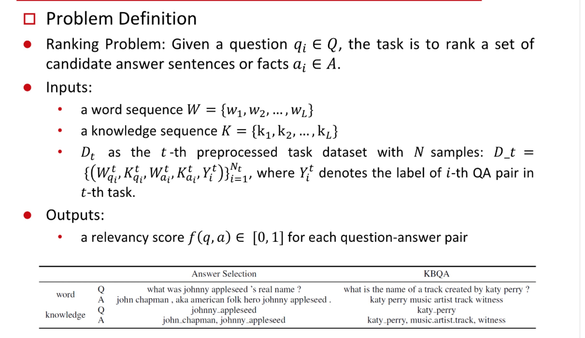
            2. 为每一个问题和候选答案准备一个word sequence W 和一个knowledge sequence K;
            3. AS的问题句子、答案句子，以及KBQA的问题句子的知识序列knowledge sequence是通过实体链接获得的（For the question and answer in answer selection and the question in KBQA, we derive the knowledge of the sentence by entity link- ing (Savenkov and Agichtein 2017).）；
            4. KBQA的答案事实的单词序列word sequence是通过tokenized entity name和relation name获得的（For the answer fact in KBQA, we obtain the word sequence from the tokenized en- tity name and relation name (Yu et al. 2017).）；
            5. 多任务学习的T个任务中的其中一个任务t的预处理数据集如下：
                1. 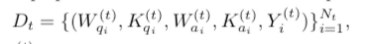
                2. $N_t$: t任务的数据集的数据数量；
                3. $W^{(t)}_{qi}$: 对于t任务，第i个问答对问题qi的word sequence；
                4. $K^{(t)}_{qi}$: 对于t任务，第i个问答对问题qi的knowledge sequence；
                5. $W^{(t)}_{ai}$: 对于t任务，第i个问答对答案ai的word sequence；
                6. $K^{(t)}_{ai}$: 对于t任务，第i个问答对答案ai的knowledge sequence；
                7. $Y^{(t)}_i$: 对于t任务，第i个问答对的标签（有监督？）；
    2. MTQA-net:
        1. 整体结构：基础多任务学习模型借鉴了论文(Guo, Pasunuru, and Bansal 2018)的特定层共享机制；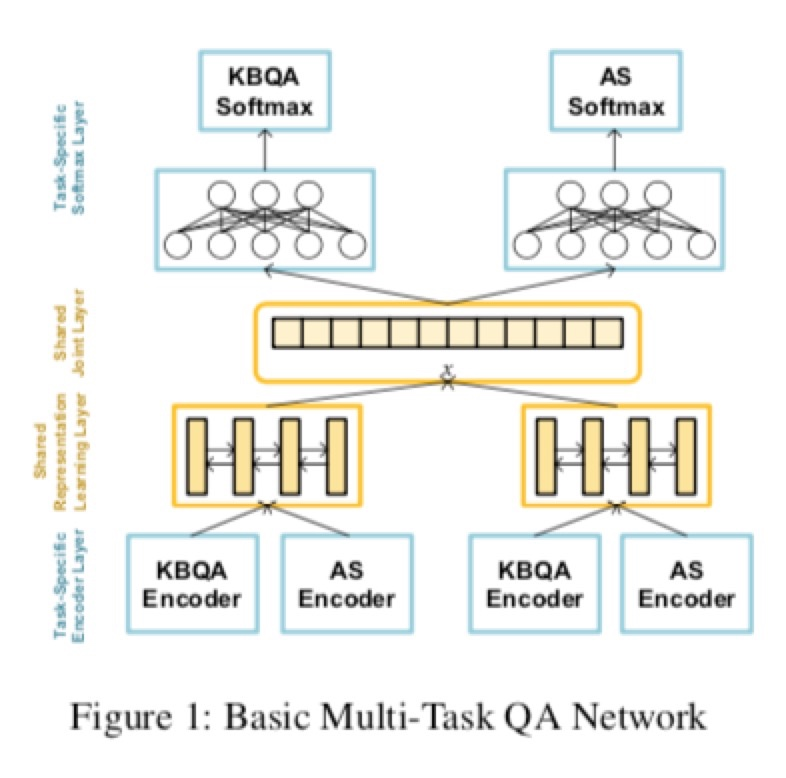

        2. 特定任务编码器层(Task-specific Encoder layer):
            1. 编码器层整体结构：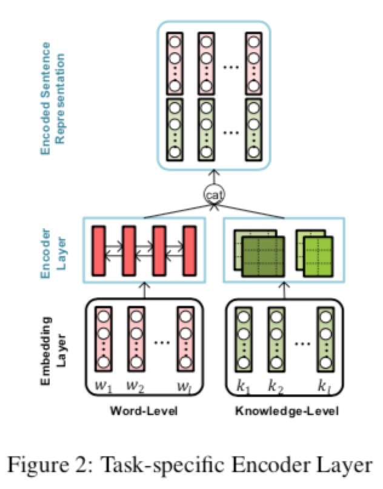
            2. 嵌入层Embedding layer:
                1. 经预处理的句子首先被编码成分布式向量表示distributed vetor representations;
            3. 编码层Encoder layer:不同QA任务的数据分布以及low-level representation一般不同；所以，每个任务都为问题和答案配备了特定任务编码器，以学习集成句子表示；
                1. Word Encoder:
                    1. 输入：词嵌入向量序列，一个句子的所有词的word embedding组成的序列；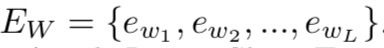

                    2. 模型：Bi-LSTM；

                    3. Bi-LSTM捕捉head-to-tail以及tail-head的上下文信息；
                    4. 输出：基于词的句子表示word-based sentence representation$H_W \in R^{L*d_h}$；
                        1. 其中，L表示句子长度，dh表示隐藏层单元个数（很好理解）；
                        2. 

                2. Knowledge Encoder:
                    1. 输入：知识嵌入向量序列，一个知识序列的所有知识的knowledge embedding组成的序列；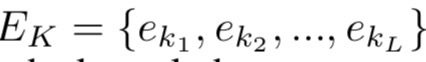
                    2. 模型：CNN；
                    3. 知识嵌入序列由一系列标记好的实体或者关系名称组成，而我们在后面的学习过程中需要high-level的knowledge-based表示，所以将知识嵌入序列通过一个CNN，在知识嵌入矩阵上滑动，窗口大小为n，捕捉局部的n-gram特征。每一次滑动的隐层向量计算如下：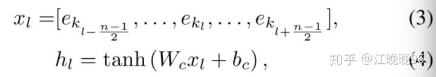
                    4. 由于实体长度的不确定性，用了多种size的filters，得到不同的输出向量：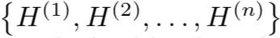
                    5. 将这些输出向量通过一个全连接层以获得knowledge-based句子表示；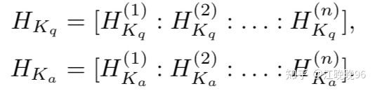

                    6. 输出：基于知识的句子表示knowledge-based sentence representation$H_K \in R^{L*d_f}$；
                        1. L是句子长度，df是CNN的filter大小。
            4. 总输出：word-based句子表示和knowledge-based句子表示的连接向量；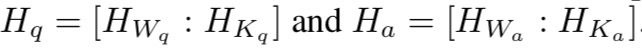
                1. After obtaining the word-based and the knowledge-based sentence representations, HKq and HKa are still vectors in the order of words in the sentence, since the fully-connected layer concatenates the outputs from all the filters in the di- mension of the feature instead of the sequence. Thus, the order of HKq and HKa is consistent with HWq and HWa . Then we concatenate them into the encoded sentence repre- sentations,Hq=[HWq :HKq]andHa=[HWa :HKa].
        3. 共享表示学习层(Shared Representation learning layer):
            1. 输入：不同任务的task-specific encoder的输出共享，组合在一起得到输入向量集；
            2. 用task-specific encoder把句子编码成向量表示后，通过一个共享表示学习层将不同任务的high-level信息进行共享。
            3. 相较于task-specific encoder layer的输入，集成句子表示包含更丰富的语义，且它们的分布更相似；
            4. 模型：high-level shared Siamese Bi-LSTM；
            5. 输出：
                1. 整合两个任务的编码向量并通过一个high-level shared Siamese Bi-LSTM，生成最终的QA表示：
                2. 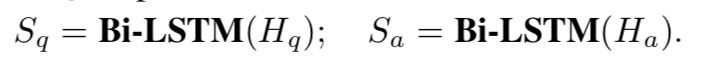
                3. 同时在Bi-LSTM模型的输出上使用average pooling：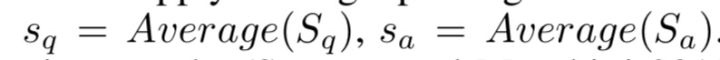
                4. 然后还整合了一些word overlap和knowledge overlap特征$x_{ol}$ ，包括 word overlap score, non-stop word overlap score, weighted word overlap score, non-stop weighted word overlap score, knowledge overlap score and weighted knowledge overlap score。
                5. 最终的特征空间为：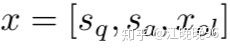
        4. 特定任务Softmax层(Task-specific Softmax layer):
            1. 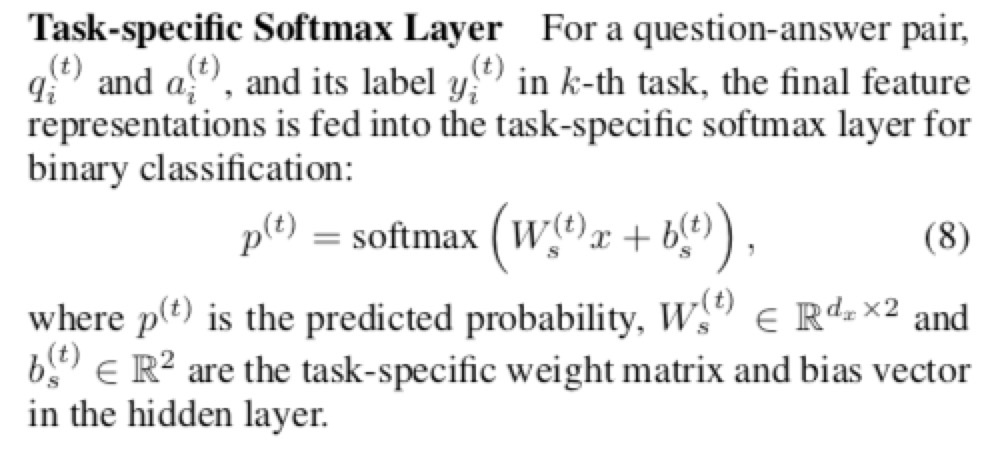
        5. 多任务学习(Multi-Task Learning):
            1. 总的目标函数：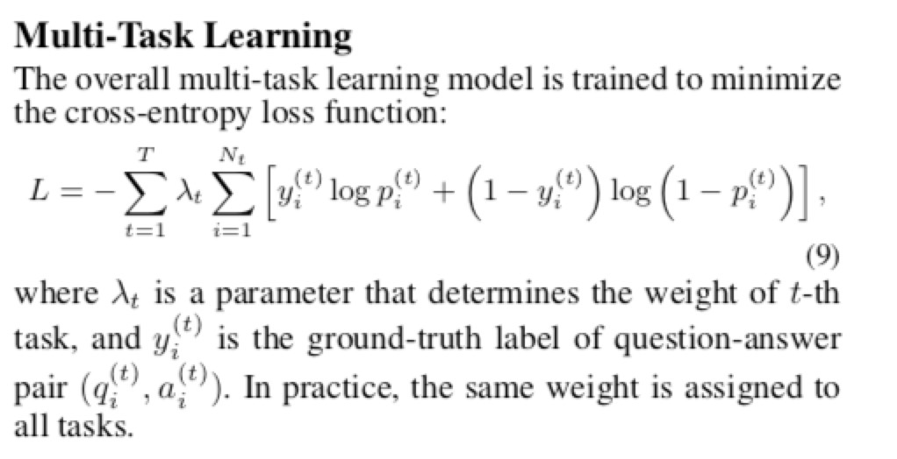
4. Muti-Task Model with Multi-View Attention--贡献2: 为了在隐表示空间增强不同任务之间的相互作用，提出一种multi-view注意力机制。
    1. 多视图注意力机制方案(Multi-View Attention Scheme):
        1. 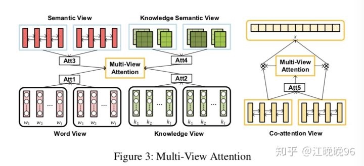
        2. 首先，不仅仅利用task-specific层的attention，还结合了shared层的attention。其次，从word-level和knowledge-level这两个视角分别获得注意力信息。具体来说，有5个视角的attention：the views of word, knowledge, semantic, knowledge semantic and co-attention. 
    2. 词视图&知识视图(Word View&Knowledge View):
        1. 采用了attentive pooling network双向注意力机制来得到word view和knowledge view的注意力权重；
        2. 输入：问答对的词嵌入序列和知识嵌入序列；
        3. 中间输出：注意力矩阵；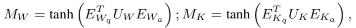

        4. 输出：问答对的词视图注意力权重，知识视图注意力权重；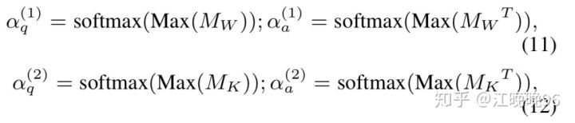
            1. 通过对注意力矩阵的行和列做max pooling得到；
    3. 语义视图&知识语义视图(Semantic View&Knowledge Semantic View):
        1. 由于上下文语义信息在句子表示学习中非常重要，我们利用整体上下文语义信息作为句子中所有元素的注意力源。 因此，我们在任务专用编码器层的输出上应用max/mean pooling，以获得句子的整体语义信息。我们尝试使用max或mean pool来生成语义信息。 结果表明以下池方法实现了最佳性能：
        2. 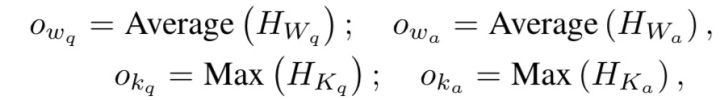
        3. 从概念上讲，注意机制考虑语义信息，这可以从问题词和答案词之间的相关性捕获：
        4. semantic view：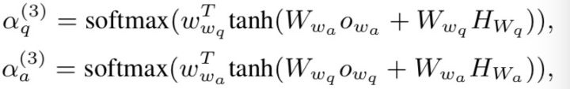
        5. knowledge semantic view：
    4. Co-attention View:
        1. 也采用双向注意力机制，同词视图和知识视图，以生成最终问题和答案表示之间的co-attention；
        2. 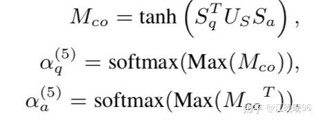

    5. Multi-View Attentive Representation:
        1. 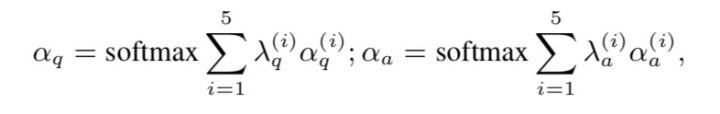
        2. 最后的attentive qa表示如下：
        3. 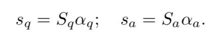
    6. Multi-View Attention Sharing:
        1. 由于多视图注意力应用于共享表示层中的隐藏状态，因此计算注意权重的参数能在任务之间共享。同时，由于多视图注意力方案从特定于任务层和共享层收集信息，因此通过多视图注意力能连接不同的任务。
5. 实验：
    1. 数据集与预处理：
        1. Yahoo QA: 从yahoo答案中获取的基于社区的开放域数据集；
            1. 过滤掉长度小于5和大于50的问题，每个问题生成4个negative sample答案；
        2. TREC QA: 广泛使用的事实类问答数据集；
        3. SimpleQuestion: A single-relation KBQA dataset. This dataset consists of questions annotated with a corresponding fact from Freebase that provides the answer;
        4. WebQSP: A multi-relation KBQA dataset;
        5. 预处理：使用facebook的FB5M作为问答知识库，使用实体链接器工具TagMe从YahooQA和TRECQA的问答对中抽取实体mention，并链接到知识库中的实体，只保留置信度高于0.2分的实体mention；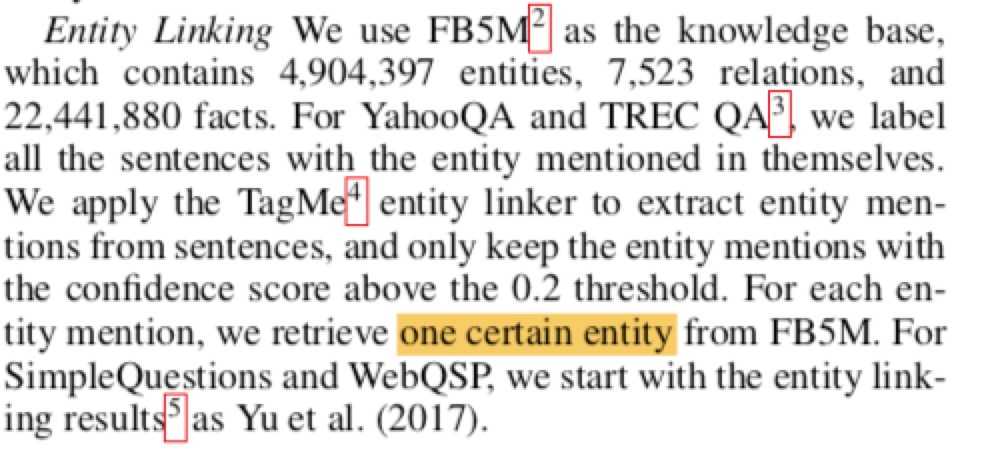

    2. 实验环境设置：
    3. 多任务学习结果：
        1. 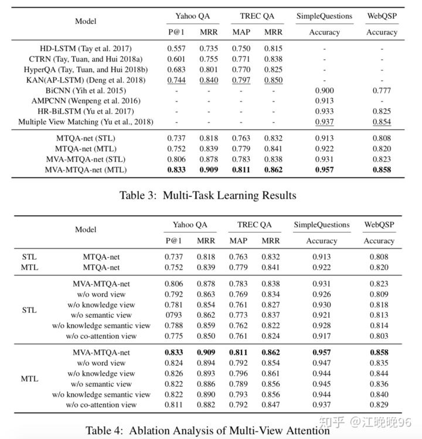
        2. AS Task：前4个模型是as模型，在YahooQA和TRECQA上都达到了state-of-the-art效果；
            1. 前3个是传统单任务学习方法；
            2. while Deng et al. (2018) employs transfer learning method to pre-train the model with a large-scale dataset and leverages exter- nal knowledge from KB to improve the sentence represen- tational learning；
        3. KBQA Task: 
            1. compare the proposed method to four single-task learning state-of-the-art methods.
            2. Note that we start with the same entity linking results as Yu et al. (2017).
        4. 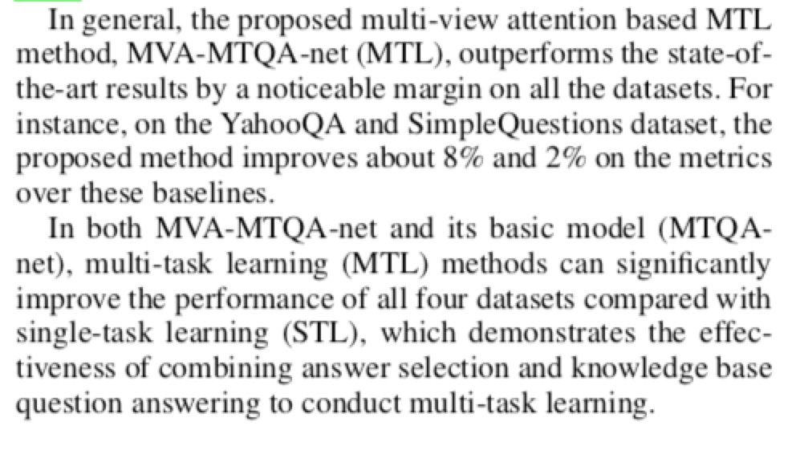
    4. Multi-View Attention的消融实验（分析不同参数或结构对实验结果产生的影响从而得到不同成分的作用）
        1. 在本节中，我们进行消融实验，以说明多视图注意力方案在所提方法中的效果。 我们逐一从MVA-MTQA-Net中排除五种视图注意力，并在表4中报告结果，包括单任务学习和多任务学习结果。
        2. co-attention对改进做出了最大贡献，这使得四个任务的STL和MTL都增加了2-3％。
        3. 对于STL，知识和知识语义视图注意在两个答案选择任务，即Yahoo QA和TREC QA中比单词视图和语义视图的效果影响更大，这表明更多的关注句子中的知识信息能够更好的发掘问题和正确答案之间的相关性；
        4. 同样，在SimpleQuesions和WebQSP任务中，两个词级视图和两个知识级视图注意之间差别不大。 然而，单词视图和语义关注贡献更多。
        5. 对于MTL，我们观察到每个注意视图对四个任务的改进做出类似贡献，这表明多视图注意方案使得每个任务在多任务学习中彼此交互。
    5. Multi-View Attention的案例分析：
        1. 通过从每种视图中可视化注意力权重，多视图注意力方案提供了一种直观的方式来观察问题和答案中每个单词的重要性。
        2. 由于空间有限，论文从TREC QA数据集和SimpleQuestion中各随机选择一个问答对进行分析，为了更能区分各视图，注意权重的每个视图被归一化为[0,1]。
        3. 图4（a）（c）显示了来自TREC QA的例子的预测注意力。 对于来自单词视图的注意力，我们观察到在问题和答案中具有丰富信息（例如，“johnny appleseed”和“real name”）的单词获得高权重。 另一方面，具有有价值信息的实体，例如“johnny appleseed”和“john chapman”，在知识视图中被赋予高权重。 在两个语义视图中，不仅注意了相似的单词，而且还注意了相关的句子元素，例如“aka american folk hero”。 在co-attention的视图中，所有单词的注意力分布更加综合。 一般而言，词级注意力的区别并不像知识水平那样有效。 结果表明，知识水平信息的结合有助于在答案选择任务中提供更有价值的信息。
        4. In general, the distinction in word-level attentions is not as ef- fective as that of knowledge-level. The results indicate that the incorporation of knowledge-level information aids in at- tending more valuable information in answer selection task.
        5. 图4（b）（d）提供了SimpleQuesions的一个例子。 对于这个问题，我们观察到与图4（a）中问题示例的注意权重相似的分布，因为KBQA任务中的问题形式与答案选择任务中的问题形式一致。 然而，对于答案，单词级别的注意力补偿了知识级别注意力的不足，例如“指南”，由于KG的不完整性而在知识级注意中被忽略。 该结果证明了在KBQA任务中结合词级和知识级信息的有效性。

