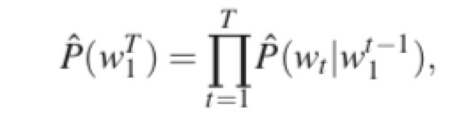
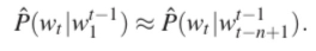

## 腾讯项目组汇报（三十八）--2019/03/11

### 一、工作进展

1. 阅读了论文SimpleQuestions Nearly Solved: A New Upperbound and Baseline Approach，准备实验下模型，看可否使用海南知识图谱数据跑；
2. github上发现了几个不错的库：
    1. [nlp_tutorial](https://github.com/graykode/nlp-tutorial);
    2. [seriousmac / awesome-qa](https://github.com/seriousmac/awesome-qa);
    3. [EdmundDuntis / Awesome-Chinese-NLP](https://github.com/EdmundDuntis/Awesome-Chinese-NLP);
    4. [roomylee / awesome-relation-extraction](https://github.com/roomylee/awesome-relation-extraction);
3. 准备从上述库中找一个kbqa的模型和一个关系抽取的模型，加到海南知识图谱上；
4. 阅读论文，补足一下深度学习模型的基础知识；

### 二、论文阅读--“A Neural Probabilistic Language Model”

1. Abstract
    1. 统计语言模型旨在学习一种语言中单词序列的联合概率函数；
    2. 维度灾难使得统计语言模型难以学习语言中单词序列的联合概率分布；
    3. 贡献：
        1. 提出一种神经概率语言模型，同时学习：
            1. 词的分布式表示；
            2. 使用词的分布式表示来表达的，词序列的联合概率函数；
        2. 使用大量数据训练大网络的高效方法，且可行；
2. Intro
    1. 统计语言模型可以表示成：给定前面单词序列的条件下，后面一个词出现的条件概率：；
        1. $W_t$：第t个单词；
        2. $w^{j}_i=(w_i, w_{i+1}, ..., w_{j-1}, w_j)$：第i个单词到第j个单词序列；
    2. n-gram统计语言模型可以表示成：给定前n-1个词，第n个词的条件概率：
    3. n-gram统计语言模型的缺点：
        1. 只考虑前n个词的上下文语义，不考虑n个词以外的单词携带的语义；
        2. 不考虑词的相似性；
    4. 本论文提出的模型之所以有很强的泛化能力，不仅因为其能够为相似的单词（语义上/语法上）学习相似的特征向量，而且因为其概率函数是这些特征向量的光滑连续函数，因此，特征变量的小的改变只会在概率中产生小的变化，且上述其中一个句子在训练集中的出现，不仅会提升句子本身的概率，还会提升相似句子（句子向量空间中相邻句子）的概率；
3. 神经网络模型
    1. 
4. Parallel Implementation
5. 实验结果
6. 拓展和未来工作
7. 结论

