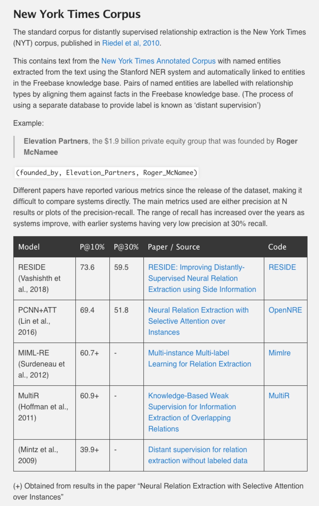
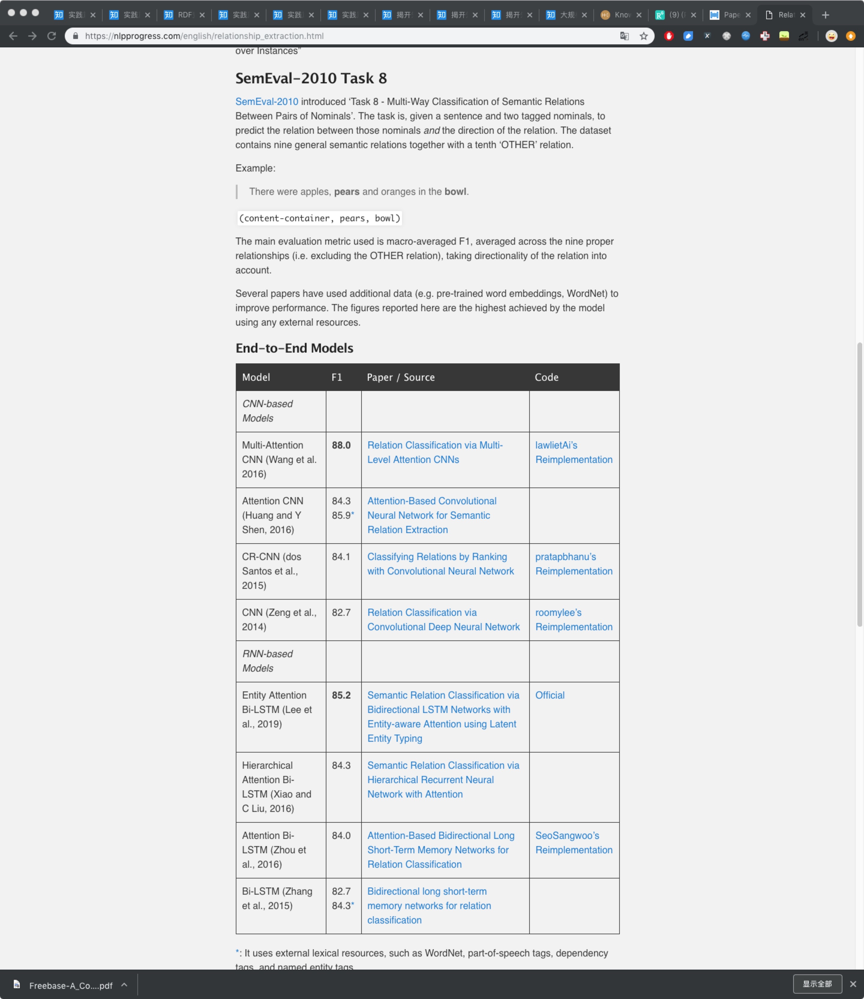
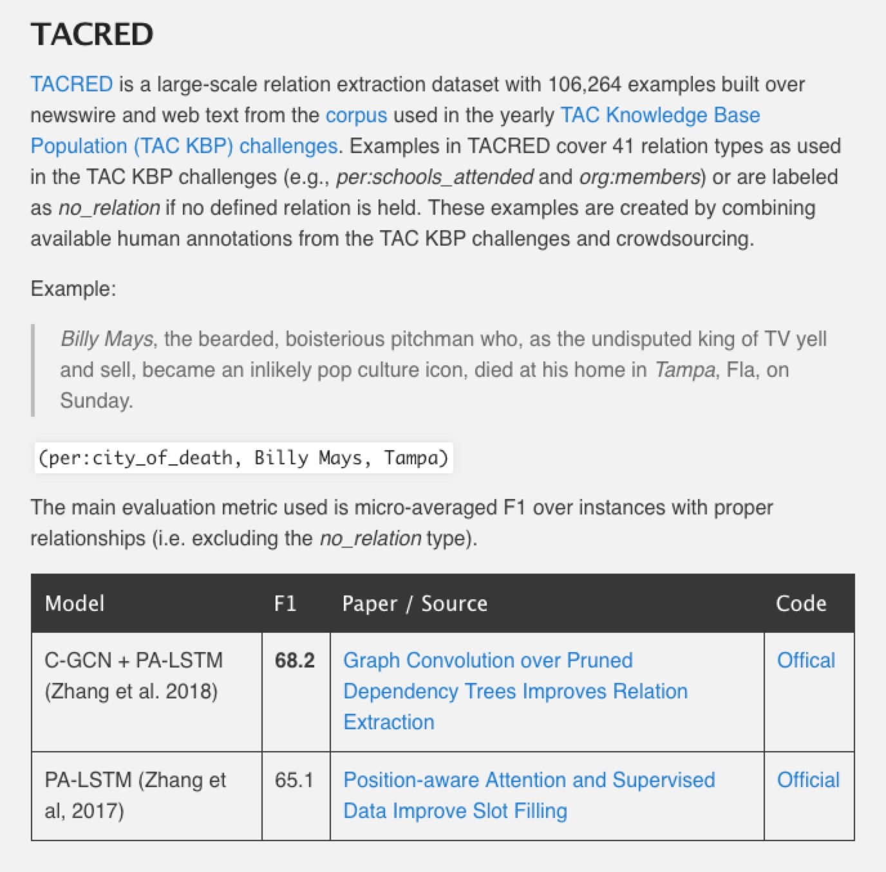

## 腾讯项目组汇报（三十九）--2019/03/13

### 一、工作进展
1. 阅读关系抽取论文；
2. 调研的关系抽取的几大benchmark数据集；
    1. New York Times Corpus: 基于远程监督的关系抽取数据集；
        1. 数据集详情及state-of-the-art模型：
    2. SemEval-2010 Task 8：
        1. 数据集详情及state-of-the-art模型：
    3. stanford TACRED：
        1. 数据集详情及state-of-the-art模型：

### 二、论文阅读---“RESIDE: Improving Distantly-Supervised Neural Relation Extraction using Side Information”

1. Abstract
    1. 通过自动对齐无结构文本与知识库中的关系实体，远程监督关系抽取方法训练出一个关系抽取器；
    2. 背景：
        1. 知识库中除了包含关系实体，还包含其他相关的辅助信息，例如关系的别名（`founded`和`co-founded`是`founderOfCompany`关系实体的别名）；
        2. 当前远程监督关系抽取模型没有利用知识库中的辅助信息；
    3. 贡献：提出一个远程监督关系抽取模型RESIDE，其
        1. 利用实体类型和关系别名信息来为关系预测添加soft constraint；
        2. 利用图卷积网络来编码文本中的句法信息，使得当辅助信息比较有限时，模型性能仍有所提升；
2. Introduction
    1. 关系抽取可视作分类问题：
        1. 给定知识库中的一个实体对(e1, e2)以及实体标注句子，模型预测实体e1与实体e2之间的关系r是预定义几类关系的哪一类；
    2. 远程监督：使用外部数据库或知识库来自动标注并构造训练数据；
        1. 远程监督假说DS assumption: 如果两个实体在知识库中存在关系r，则提及这两个实体的所有句子都表达了关系r；
        2. 远程监督假说DS assumption并非恒成立，因此远程监督存在噪声；
        3. Riedel et al. (2010); Hoffmann et al. (2011); Surdeanu et al. (2012)等研究放宽了DS assumption；
            1. Riedel et al. (2010) --> expressed-at-least-once assumption: 如果两个实体在知识库中存在关系r，则**至少一句**提及这两个实体的句子表达了关系r --> 多实例单标签学习multi-instance single-label learning；
            2. Hoffmann et al. (2011) --> 关系可能会重叠：一对实体e1，e2可能会存在多种关系 --> 多实例多标签学习multi-instance multi-label learning；
    3. 神经网络关系抽取：
        1. 使用attention机制来缓解远程监督数据集中的噪声(Lin et al., 2016; Jat et al., 2018)；
        2. 使用图卷积网络GCN来编码文本的句法信息(Mintz et al., 2009; He et al., 2018)；
3. 相关工作
    1. 
4. 背景：图卷积网络
5. RESIDE概览
6. RESIDE细节
7. 实验
8. 实验结果
9. 结论