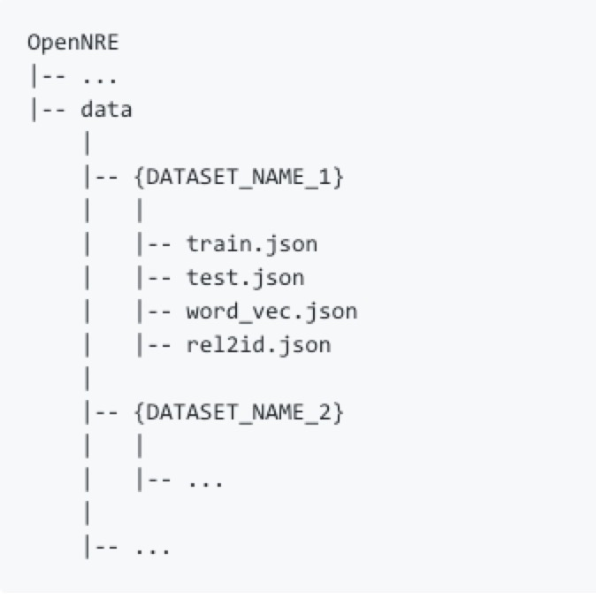
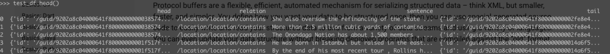
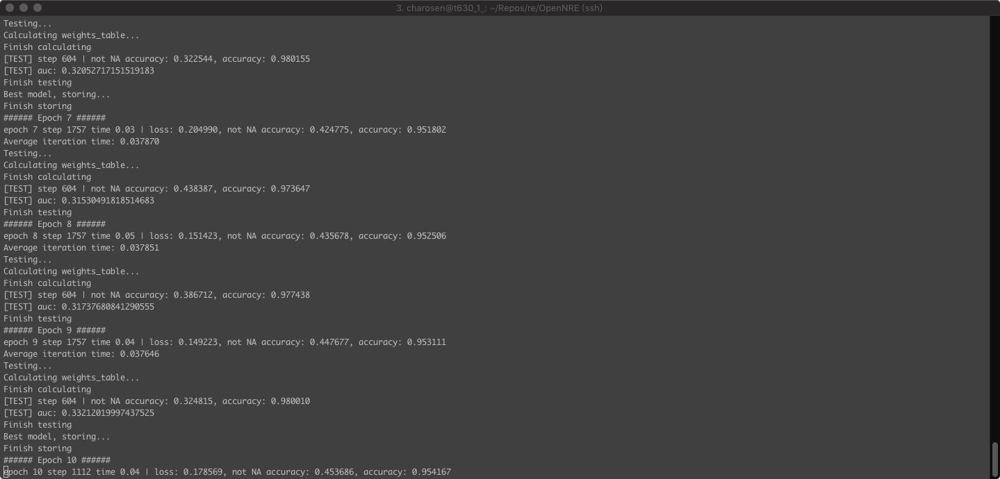

## 腾讯项目组汇报（四十）--2019/03/18

### 一、工作进展

1. 根据RESIDE那篇论文的引用论文，阅读下述参考文献：
    1. 阅读论文"Neural Relation Extraction with Selective Attention over Instances"；
    2. 阅读论文"Distant Supervision for Relation Extraction via Piecewise Convolutional Neural Networks"；
2. 调试上述两篇论文的代码[OpenNRE](https://github.com/thunlp/OpenNRE)；
    1. 完成NYT10数据集的预处理，将其转换成json格式的数据集文件`train.json`, `test.json`, `word_vec.json`, `rel2id.json`：
        1. 数据集组织结构：
        2. `train.json`文件格式：
        3. `test.json`文件格式与上述`train.json`相同；
        4. `rel2id.json`文件格式：存储freebase关系名称与id的映射关系；
        5. `word_vec.json`：预训练的word2vec embedding；
        6. 数据集预处理源代码使用到了google的protobuf，现在正在学习相关内容；
    2. 在t630_1_服务器上跑PCNN+ATT的关系抽取模型，训练过程中阅读源代码：

参考链接：
1. [pandas.read_json()接口参数介绍](https://blog.csdn.net/qq_24499417/article/details/81428594);
2. [pandas.read_json()官方文档](https://pandas.pydata.org/pandas-docs/stable/reference/api/pandas.read_json.html)