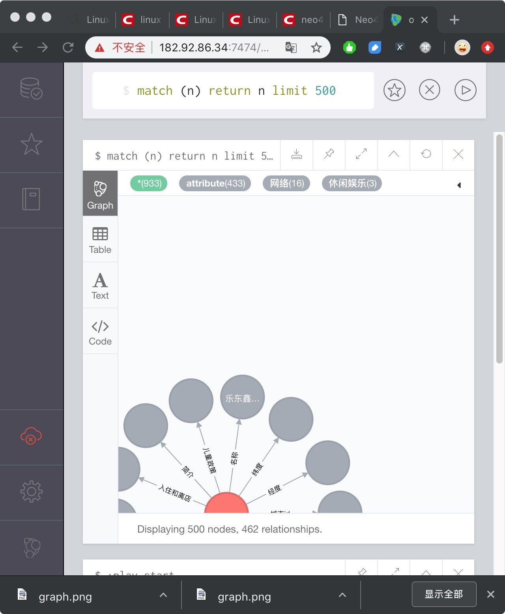
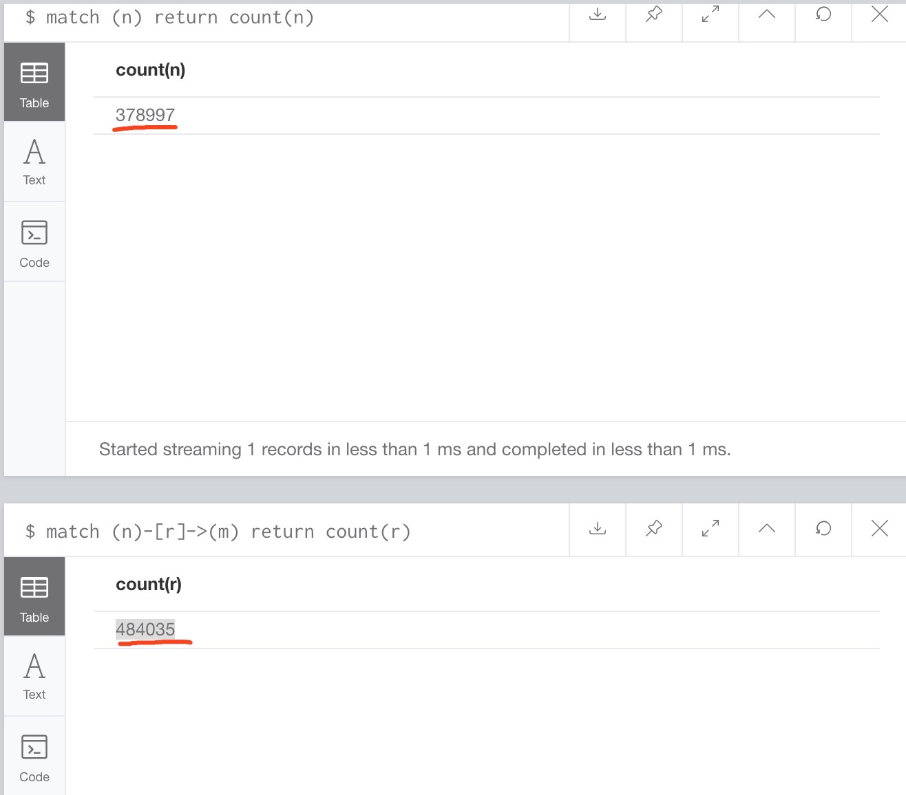

## 腾讯项目组汇报（四十一）--2019/04/12

### 一、工作进展

1. 在服务器182.92.86.34上构建neo4j的第2版海南旅游知识图谱，可以在浏览器上访问182.92.86.34:7474来查看知识图谱：
    1. 只允许用match命令，即查询（读）知识图谱，因为当前用户有写权限，不要往知识图谱里误加数据，查询语句最好加上limit，知识图谱太大
2. 当前知识图谱为单数据源携程的海南旅游知识图谱，neo4j中包含378997个节点，484035条关系事实，且该知识图谱是个复杂网络：
    1. 
    2. 文昌市相关的子复杂网络：

    3. 陵水市相关的子复杂网络：
3. 后续将fuseki+rdf版本的旅游知识图谱发布到服务器上；
4. 欢迎实验大佬们使用旅游知识图谱并提供建议！！

