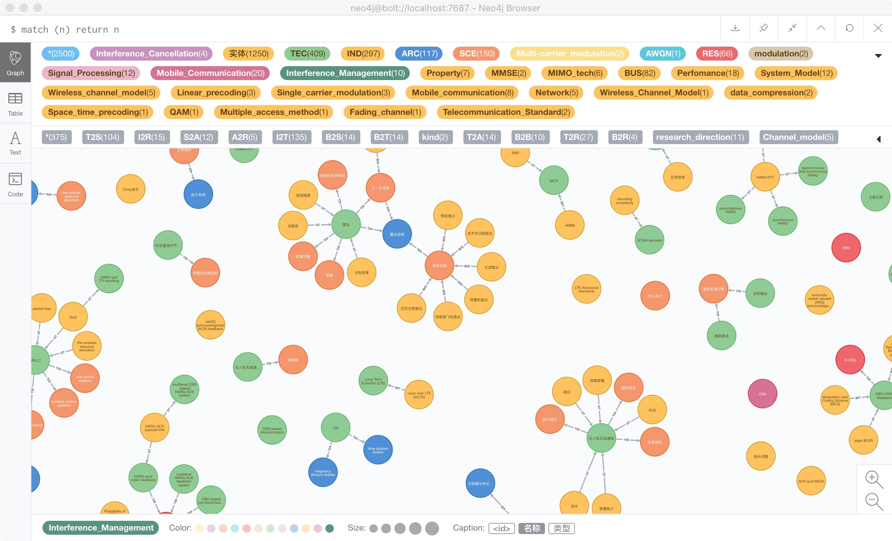

## 腾讯项目组汇报（四十三）--2019/05/16

### 一、工作进展

1. 构建通信知识图谱telecommKG demo
    1. 根据小曹师兄提供的实体文件、关系三元组文件，构建实体节点1250个，实体关系365条；
    2. 此次构建使用了neo4j的第三方库apoc，为neo4j知识图谱提供了更加灵活的构建方式，能够根据数据文件动态指定节点标签和关系类型；
    3. apoc真的很强大，以后摒弃load csv
    4. 
2. 最近在看图卷积的论文，仍在总结ing
3. apoc参考链接
    1. [apoc user guide](https://neo4j-contrib.github.io/neo4j-apoc-procedures/index35.html#data-creation)
    2. [Neo4j 冷启动预热缓存](http://blog.npyzdf.com/2017/neo4j-warms-up/)--预热缓存有助于初始时加快查询速度
    3. [Neo4j 导入动态类型关系](http://blog.npyzdf.com/2018/neo4j-import-dynamic-relationship-type/)--原声load csv不支持导入动态类型关系
    4. [NEO4J亿级数据导入导出以及数据更新](http://www.pianshen.com/article/846554644/)
