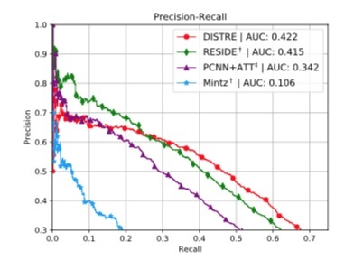

## 腾讯项目组汇报（四十六）--2020/02/22

最近复现ACL 2019的远程监督关系抽取论文DISTRE([github link](https://github.com/DFKI-NLP/DISTRE))，核心思想就是实现了预训练模型+远程监督的Bag-level注意力机制，在nyt数据集上达到了`auc 0.422`和较高的召回率

<h2>1. 实验环境的复现结果与比较</h2>

论文给出的官方环境为：

1. Python 3.6.6
2. PyTorch 1.0.1
3. AllenNLP 0.7.1
4. SpaCy 2.0.18
5. en_core_web._sm 2.0.0

**论文并未提供其预处理的数据**，使用OpenNRE提供的官方版本数据进行复现，得到`auc 0.398`，与论文结果相差甚远。

经过测试，使用如下的实验环境能够获取更好的实验结果，`auc 0.408`(Python和PyTorch版本对实验影响不大)：

1. Python 3.6.8
2. PyTorch 0.4.1
3. AllenNLP 0.7.1
4. SpaCy 2.2.3
5. en_core_web_sm 2.2.5

而实验环境的本质区别在于使用了更新的版本的SpaCy分词模型en_core_web_sm，这也证明了更好的分词及句法依存分析，能够使得关系抽取效果得到一点提升，这只是在传统nlp工具上做的**短平快测试**，还未对模型做修改，后续在模型上做改进。

<h2> 2. 远程监督关系抽取NYT数据集说明</h2>

DISTRE在使用官方版本数据训练时，并未获得论文结果，这里必须交代一下NYT数据集的背景，主要分为3个版本：

1. 原始的Riedel2010版本（训练集与测试集存在重叠部分）：

    | Split | # Sentences | # Entity-pairs |
    | --- | --- | --- |
    | Train | 570300 | >291699 |
    | Test | 172448 | 96678 |

2. RESIDE版本（训练集与测试集存在重叠部分）：

    | Split | # Sentences | # Entity-pairs |
    | --- | --- | --- |
    | Train | 570088 | 291699 |
    | Test | 172448 | 96678 |

3. OpenNRE版本（训练集与测试集无重叠）：

    | Split | # Sentences | # Entity-pairs |
    | --- | --- | --- |
    | Train | 522611 | 281270 |
    | Test | 172448 | 96678 |
    
而最早的CNN, PCNN, PCNN+ATT, APCNN模型都是在原始的Riedel2010版本上训练得到的结果，而且，我们都知道，训练数据和测试数据存在重叠，可以获得更好的实验结果，但是OpenNRE在开源时只提供了无重叠版本数据（论文刚发布时提供了重叠版本），导致结果无法复现。

后续，远程监督关系抽取模型的论文大都是论文中说明使用522611句子的无重叠nyt数据集，但实验用的是570000+句子的重叠nyt数据集，因此我猜测DISTRE也是在数据集上动了手脚。

我对论文提供的[Trained Model](https://cloud.dfki.de/owncloud/index.php/s/jJit9giM325MfJA/download)进行测试，应证了我的想法：

1. AllenNLP是会对训练数据的词汇、标签计数，构建词表，Trained Model的训练关系类别标签词表包含58种关系（其中包含2种测试数据集中才有的关系），而无重叠数据的训练集只有56种关系，可见，DISTRE使用了重叠数据集。
2. 同时，DISTRE是直接对58种关系就行分类，而不是把5种out-of-vocabulary的关系作为NA关系进行分类，即对53种关系分类。

进一步使用重叠数据集复现实验：

| Datasets | AUC |
| --- | --- |
| OpenNRE无重叠数据+58种关系 | 0.413 |
| RESIDE重叠数据集+58种关系 | 0.467 |
| **RESIDE重叠数据集+53种关系（RESIDE使用的版本）** | **0.486** |
| Riedel2010重叠数据集+58种关系 | 0.483 |
| Riedel2010重叠数据集+53种关系 | 0.504 |

可见，DISTRE也是通过使用一定重叠的数据集得到的0.422结果。

由于论文作者不回复其数据预处理方式，因此，我准备使用RESIDE使用的数据版本进行baseline实验，在此之上改进模型。

