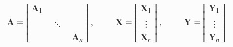

#  腾讯项目组汇报（四十八）--2020/03/11

<h2>1. 多进程DatasetReader</h2>

nlp tagger对句子标注依存树比较耗时，导致一次数据集读取及nlp tagger的依存分析预处理会消耗较长时间，因此，我尝试将DatasetReader改写成多进程形式。

对于多进程的DatasetReader，allennlp内置提供了MultiProcessDatasetReader的wrapper，但是今天尝试的时候发现它与依存句法分析spacy token不兼容，遇到了
`spacy token are not pickleable`问题。

经研究，发现allennlp的github库上存在几个相关issue，这些issue也没有很好的解决spacy token与多进程数据读取的问题，只能依旧使用单进程数据读取，相关issue如下：

1. [spacy Tokens are not pickleable, which breaks the multiprocess dataset reader #1887](https://github.com/allenai/allennlp/issues/1887)
2. [make spacy word splitter return allennlp Tokens (now NamedTuples) by default #2607](https://github.com/allenai/allennlp/pull/2607/commits/9c94fcb7829def0daf624c1d947b87d83ceffdfe)

<h2>2. multi-head GraphEvoTRE</h2>

完成了对bug的修复，使用[PyTorch Geometric](https://pytorch-geometric.readthedocs.io/en/latest/index.html)拓展库来写图卷积，实现GPU并行卷积多个稀疏图的特征，主要是通过将多个图稀疏邻接矩阵拼凑成一个高维的对角稀疏邻接矩阵来完成并行计算，缩短了训练时间。

关于多个图稀疏邻接矩阵及对应节点特征的拼接，主要使用了如下类：

1. [torch_geometric.data.Data](https://pytorch-geometric.readthedocs.io/en/latest/_modules/torch_geometric/data/data.html#Data): Pytorch Geometric的图数据结构，支持许多图数据操作、图邻接矩阵、节点特征、边特征等；
2. [torch_geometric.data.Batch](https://pytorch-geometric.readthedocs.io/en/latest/_modules/torch_geometric/data/batch.html#Batch): 将多个稀疏图转换成一个对角稀疏图

关于GraphEvoConv卷积，主要参考了Pytorch Geometric中的实现：

1. [torch_geometric.nn.conv.gat_conv](https://github.com/rusty1s/pytorch_geometric/blob/a90b115320968a7698208944221d8de15d6c01ab/torch_geometric/nn/conv/gat_conv.py#L10)：GAT的稀疏图卷积实现
2. [torch_geometric.examples.ppi](https://github.com/rusty1s/pytorch_geometric/blob/master/examples/ppi.py): GAT神经网络在ppi数据集上的实现

`nn.Conv`中包含了当前热门图卷积神经网络的卷积层稀疏实现, `nn`中包含了当前热门图卷积神经网络的稀疏实现，`examples`中包含了诸多图卷积网络论文的复现例子。

Pytorch Geometric参考资料：

1. [Introduction by Example](https://pytorch-geometric.readthedocs.io/en/latest/notes/introduction.html): 入门教程，介绍了Pytorch Geometric的核心概念，包括其如何建模图结构，图数据结构支持，多图的mini-batch支持，稀疏图卷积层实现，内置常用图数据集等；
2. [Creating Message Passing Networks](https://pytorch-geometric.readthedocs.io/en/latest/notes/create_gnn.html)：稀疏图卷积层实现的核心思想及入门教程
3. [Creating Your Own Datasets](https://pytorch-geometric.readthedocs.io/en/latest/notes/create_dataset.html)：内置的数据集操作；
4. [相关拓展库pytorch scatter](https://github.com/rusty1s/pytorch_scatter)
5. [相关拓展库pytorch sparse](https://github.com/rusty1s/pytorch_sparse)

AllenNLP与Pytorch Geometric的结合使用仍处于探索阶段，AllenNLP的forum中存在不少人在讨论<https://discourse.allennlp.org/t/allennlp-with-pytorch-geometric/210>

<h2>3. 实验初步结果</h2>

| Data Settings | DISTRE_clf_token(original DISTRE) | DISTRE+pos_embed_mask+sort | DISTRE+pos_embed_mask+sort+simply_word_att | DISTRE+pos_embed_mask+sort+graph_evo |
| --- | --- | --- | --- | --- |
| RESIDE NYT Datasets | auc=0.486 | auc=0.550 | auc=0.570 | auc=0.582 |
| OpenNRE NYT Datasets | auc=0.413 | auc=0.4225 | auc=0.439 | 待测试 

注释：
1. RESIDE数据集是训练集和测试集存在重叠的版本，包含570088条句子；
2. OpenNRE数据集是训练集和测试集无重叠的版本，包含526611条句子；
3. 现在GraphEvo卷积层的超参数还未tuninng；
4. 而且尚未加上创新点中的依存边召回，现在只加入了依存边的类型嵌入来计算注意力权重；
5. 远程监督NYT数据集存在严重的数据不平衡，以及远程监督引入部分错误标注，所以auc用来衡量关系分类性能，DISTRE的auc性能也仅仅比RESIDE高1%；
6. DISTRE+pos_embed_mask+sort: pos+embed_mask是指在DISTRE的原有的语言模型上，对翻译的目标词汇加上position embedding mask，避免language model head错误翻译成position embedding，因为position embedding仅用于学习句子中词的位置，而不是实际的合法词汇，sorting是对训练数据做一定排序。
7. DISTRE+pos_embed_mask+sort+simply_word_att: DISTRE只使用句子中的`__clf__`token来表示句子，简单使用word-attention来学习句子的所有token的权重以及句子表达式，比仅仅使用`__clf__`效果好；
8. DISTRE+pos_embed_mask+sort+graph_evo: 引入依存树的依存关系类型embedding来计算注意力，能够比简单的word-attention效果更好；

目前正在跑GraphEvo卷积层的超参数的tuning，准备发邮件给DISTRE的作者，询问他们的数据处理方法，看有没有可能拿到他们预处理过的NYT数据集。

